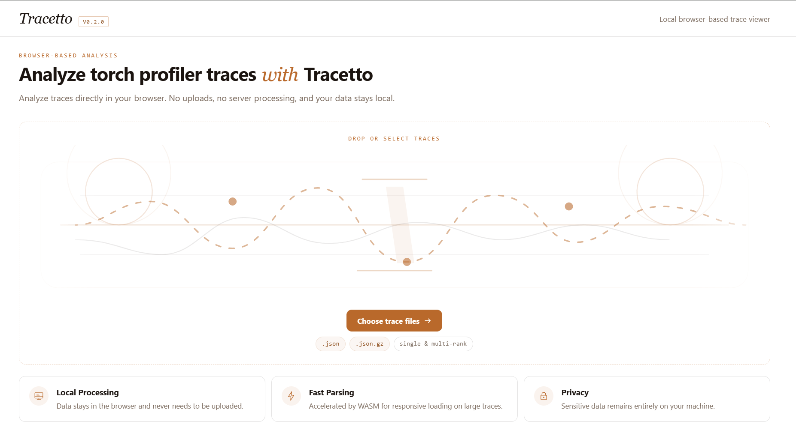
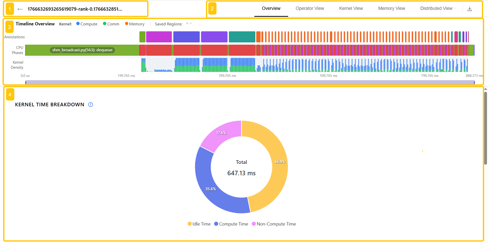
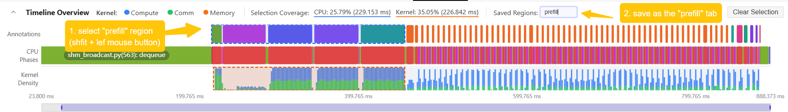
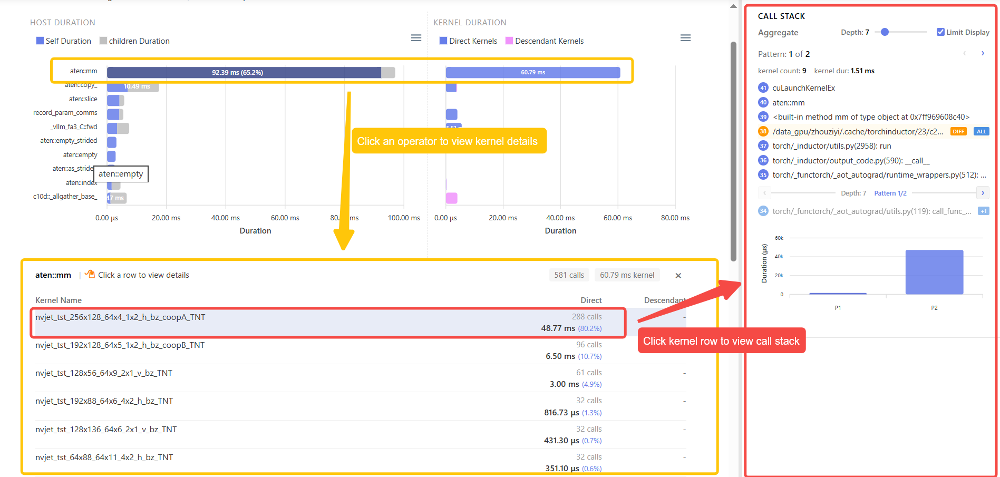
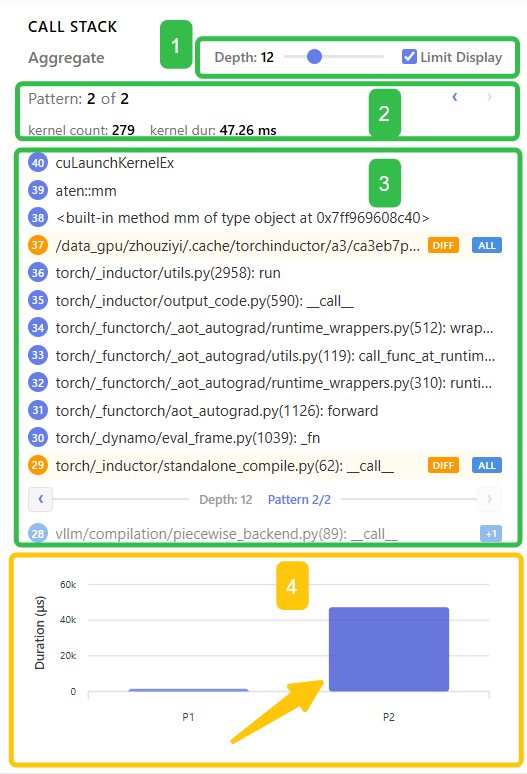

# Tracetto User Guide

**Language / 语言:** [简体中文](../zh-CN/quickstart.md) | English

For algorithm and performance engineers using the Web UI to analyze PyTorch Profiler traces.

Tracetto is a browser-side analysis tool for PyTorch Profiler traces. It is not just a trace opener; it helps you answer performance questions such as:

- Whether GPU time is spent mostly on compute, communication, memory movement, or idle gaps
- Which operators and kernels are the real hotspots
- Whether CPU launch overhead is holding the GPU back
- Whether multi-rank workloads are imbalanced, and whether communication is effectively overlapped with compute
- Whether a specific phase or module is the main bottleneck

Tracetto parses traces locally in the browser. No data upload is required, so analysis is safe and fast.



_Tracetto browser import page: visit [https://www.tracetto.com/](https://www.tracetto.com/), pick a trace file, and parse it locally in the browser._

> **Goal of this guide**: help you complete your first end-to-end analysis in about 10 minutes. For field definitions, full interaction details, common scenarios, and FAQ, see [reference.md](./reference.md).
>
> **Assumptions**: you already know the basic PyTorch Profiler collection flow and have a working understanding of CUDA streams, kernels, and collective communication. If you are new to PyTorch performance analysis, read the official PyTorch Profiler tutorial first.

## Working with Perfetto

Tracetto is **not a replacement for Perfetto**. The two tools answer questions at different levels and are intended to be used together:


| Tool       | Question it answers            | Strengths                                                                                                                     |
| ---------- | ------------------------------ | ----------------------------------------------------------------------------------------------------------------------------- |
| `Tracetto` | Where is it slow, and why      | Automatic `Compute / Non-Compute / Idle` breakdown, operator / kernel hotspot ranking, aggregated call stacks, multi-rank overlap |
| `Perfetto` | What exactly happened here     | Pixel-level timeline, per-event CPU / GPU expansion, inter-stream dependency arrows, free-form SQL queries                    |

**Recommended workflow**: use Tracetto first to frame a suspicious phase in `Timeline Overview`, narrow the suspicion to a concrete operator / kernel / collective, then open the same trace in Perfetto and jump to that time range for event-level verification. Both tools use the same PyTorch Profiler trace, so you do not need to re-capture.

Mnemonic: **Tracetto answers "where / why it is slow"; Perfetto answers "exactly how it happened".**

## Table of Contents

- [1. Quick Start](#1-quick-start)
  - [1.1 Generate an importable trace file](#11-generate-an-importable-trace-file)
  - [1.2 Access Tracetto](#12-access-tracetto)
  - [1.3 Import files](#13-import-files)
- [2. Main Analysis UI](#2-main-analysis-ui)
- [3. First End-to-End Analysis](#3-first-end-to-end-analysis)
- [4. Choose an Analysis Path by Question](#4-choose-an-analysis-path-by-question)
- [5. Timeline Overview and Selection Management](#5-timeline-overview-and-selection-management)
- [6. Further Reading](#6-further-reading)

## 1. Quick Start

### 1.1 Generate an importable trace file

Export PyTorch Profiler's Chrome Trace format directly:

```python
import torch
from torch.profiler import profile, ProfilerActivity

with profile(
    activities=[ProfilerActivity.CPU, ProfilerActivity.CUDA],
    record_shapes=True,
    profile_memory=True,
    with_stack=True
) as prof:
    model(input_data)
    loss.backward()
    optimizer.step()

prof.export_chrome_trace("trace.json")
```

For inference servers such as vLLM and SGLang, you can use their built-in PyTorch Profiler switches to generate the same type of trace.

#### vLLM server scenario

Enable PyTorch Profiler on the server with `--profiler-config`, then trigger a short profiling workload with `vllm bench serve --profile`.

Official docs: [Profiling vLLM](https://docs.vllm.ai/en/stable/contributing/profiling/)

```bash
# Terminal 1: start the vLLM OpenAI server
PROFILER_CONFIG='{
  "profiler": "torch",
  "torch_profiler_dir": "./vllm_profile",
  "torch_profiler_record_shapes": true,
  "torch_profiler_with_memory": true
}'

vllm serve meta-llama/Llama-3.1-8B-Instruct \
    --profiler-config "$PROFILER_CONFIG"

# Terminal 2: trigger the profiling workload
vllm bench serve \
    --backend vllm \
    --model meta-llama/Llama-3.1-8B-Instruct \
    --dataset-name sharegpt \
    --dataset-path sharegpt.json \
    --profile \
    --num-prompts 2
```

After collection finishes, import the generated `.pt.trace.json` or `.pt.trace.json.gz` file from `./vllm_profile` into Tracetto. Keep the number of requests small; traces can grow quickly.

#### SGLang server scenario

Set `SGLANG_TORCH_PROFILER_DIR` on both the server side and benchmark side, so traces are written to the same directory:

Official docs: [Benchmark and Profiling](https://docs.sglang.io/docs/developer_guide/benchmark_and_profiling)

```bash
# Terminal 1: start the SGLang server
export SGLANG_TORCH_PROFILER_DIR=./sglang_profile
python -m sglang.launch_server \
    --model-path meta-llama/Llama-3.1-8B-Instruct

# Terminal 2: trigger the profiling workload
export SGLANG_TORCH_PROFILER_DIR=./sglang_profile
python -m sglang.bench_serving \
    --backend sglang \
    --model meta-llama/Llama-3.1-8B-Instruct \
    --num-prompts 2 \
    --sharegpt-output-len 100 \
    --profile
```

After collection finishes, import the generated `.trace.json` or `.trace.json.gz` file from `./sglang_profile` into Tracetto. In SGLang PD-disaggregated deployments, collect prefill and decode workers separately; use `bench_serving --profile --pd-separated` with `--profile-prefill-url` or `--profile-decode-url`.

### 1.2 Access Tracetto

End users do not need to run the site locally. Open [https://www.tracetto.com/](https://www.tracetto.com/) to enter the import page.

### 1.3 Import files

- **Single file**: drag or pick one `.json` / `.json.gz` file. The page parses it automatically and opens the analysis view.
- **Multiple files**: after selecting multiple files, reorder rows in the confirmation list by dragging. The list order is the rank order. Click `Start Analysis` to confirm.
- **Large files**: the limit depends on whether the browser supports Memory64. Current front-end limits are:
  - Standard mode: raw `.json` around 2.5 GB
  - Memory64 mode: raw `.json` around 10 GB


_Multi-file import list: confirm the order, then click `Start Analysis`. Files are mapped to rank 0, rank 1, rank 2, ... according to list order._

## 2. Main Analysis UI

After importing a trace, Tracetto opens the main analysis UI. The top area handles file and view navigation, the middle `Timeline Overview` is used for global positioning and selections, and the lower area shows the charts and details for the current view.



_Tracetto main analysis UI: `1` file area, `2` view navigation and export entry, `3` global timeline and selection management, `4` current analysis view._

- **1 File area**: shows the currently opened trace file name. The back button on the left returns to the import page so you can choose files again.
- **2 View navigation and export entry**: switch between `Overview`, `Operator View`, `Kernel View`, `Memory View`, and `Distributed View`; the download icon on the right exports analysis data or reports.
- **3 Timeline Overview**: selects the region of interest for downstream analysis. It is the time-range entry point for every analysis view; after you select a phase or time range here, the lower views refresh with that selection.
- **4 Current analysis view**: shows the charts for the active tab. For example, `Overview` shows summary charts such as `Kernel Time Breakdown` and `Idle Time Statistics`.

The views are positioned as follows:


| View               | Main purpose                                            | Charts / panels                                                                                                                                                                                                                                                                                                                                                           |
| ------------------ | ------------------------------------------------------- | ------------------------------------------------------------------------------------------------------------------------------------------------------------------------------------------------------------------------------------------------------------------------------------------------------------------------------------------------------------------------- |
| `Overview`         | First stop for single-rank analysis and GPU time split  | `Kernel Time Breakdown`: donut chart of `Compute / Non-Compute / Idle` ratio.<br>`Idle Time Statistics`: splits `Host Wait`, `Kernel Wait`, and `Other Wait` by stream to locate GPU idle sources.                                                                                                                                                                       |
| `Operator View`    | Locate hotspots at the PyTorch operator level           | `Top Operators sorted by Host Self Duration`: self-time hotspots.<br>`Top Operators Sorted by Host Total Duration`: full-call hotspots.<br>Operator kernel details: kernels triggered by the selected operator.                                                                                                                                                          |
| `Kernel View`      | Diagnose GPU kernel execution and scheduling behavior   | `Kernel Type Distribution`: kernel time ratio by compute, communication, memory, and related types.<br>`Kernel Details`: Top-K kernels by type.<br>`Kernel Launch Statistics`: short kernels, runtime outliers, and launch delay outliers.<br>`Kernel Wait Queue`: queued kernels per stream over time.                                                                    |
| `Memory View`      | Diagnose memcpy and data movement bottlenecks           | `Memory Copy Bandwidth Summary`: bandwidth summary by memcpy / memset type.<br>`Memory Copy Bandwidth Over Time`: bandwidth timeline used to locate transfer peaks and abnormal ranges.                                                                                                                                                                                 |
| `Distributed View` | Analyze load balance, communication, and overlap across ranks | `Kernel Time Breakdown`: compares compute, non-compute, and idle ratios across ranks.<br>`Communication-Compute Overlap`: measures how much communication is covered by compute.<br>`Cross-Rank Kernel Timeline`: aligns kernel progress across ranks.<br>`Communication Operator Timeline`: focuses on communication operator timing.<br>`Cross-Rank Communication Operator Summary`: summarizes cross-rank duration and synchronization skew. |
| `Call Stack` sidebar | Trace a concrete kernel / event back to Python or framework calls | Aggregated call stack: source call chain for a kernel / event.<br>`Pattern` duration distribution: compares the same kernel across different call-chain patterns.<br>`view` / `all` dialogs: inspect stack frames that were ignored or differ during aggregation.                                                                                                         |

All zoomable charts in Tracetto (`Timeline Overview`, `Kernel Wait Queue`, `Memory Copy Bandwidth Over Time`, `Cross-Rank Kernel Timeline`, and others) share the same keyboard and mouse interactions.


| Action             | Effect                                                                                                      |
| ------------------ | ----------------------------------------------------------------------------------------------------------- |
| Ctrl + mouse wheel | Zoom in / out within the current chart's time window                                                        |
| W/S                | Equivalent to zooming in / out of the current time window                                                   |
| A/D                | Pan the current time window left / right                                                                    |
| Left click         | Select a color block / bar / time-series point; usually opens the right-side details panel or `Call Stack` sidebar |
| Shift + left click | In `Timeline Overview` / `Multi-Rank Timeline Overview`, merge the newly clicked range into the current selection |
| Mouse drag         | Pan inside a zoomed window, or drag the bottom zoom bar to change the visible range                         |

> Keyboard control requires the chart to be active. Click the target chart first; otherwise `W` / `S` / `A` / `D` will not take effect.

View-specific drill-down interactions, such as operator -> kernel details and kernel -> `Call Stack`, are described in the corresponding sections of [reference.md](./reference.md).

## 3. First End-to-End Analysis

If you have just opened a trace and do not know where to start, follow this path to complete a minimal analysis loop. The example compares `prefill` and `decode` and locates a hot operator in the `prefill` phase.

**Step 1 - Select the prefill phase in `Timeline Overview`**

In `Timeline Overview`, select the `prefill` range you want to analyze. Follow the numbered steps in the screenshot:

- Step `1`: click the `Annotations` or `CPU Phases` range that corresponds to `prefill`; if `prefill` spans multiple adjacent segments, hold `Shift` and continue clicking to merge them into the same selection
- Confirm that `Selection Coverage` has updated, which means downstream views will recompute based on the current selection
- Step `2`: enter `prefill` in `Saved Regions` and save it as a tab, so you can switch back to the same analysis range later



_Select the prefill range in `Timeline Overview` and save it as a `prefill` tab. All downstream views refresh their statistics according to this selection._

**Step 2 - Go to Overview and check whether the kernel time distribution is healthy**

Enter `Overview`:

- Start with `Kernel Time Breakdown`: check which part of `Compute / Non-Compute / Idle` is relatively high.
- If `Idle` is relatively high, check `Idle Time Statistics` to see whether it is `Host Wait`, `Kernel Wait`, or `Other Wait`.


**Step 3 - Go to Operator View and locate the top operator**

In `Operator View`, read the screenshot by region:

- Start with area `2`: this is the hotspot view sorted by `Host Self Duration`, used to find the operator with the highest self time. In the screenshot, `aten::mm` has `92.39 ms` of `Host Self Duration`, accounting for `65.2%`, making it the most prominent operator in the current prefill selection
- Then combine it with area `2.2`: the right-side `Kernel Duration` shows `60.79 ms` of kernel time for `aten::mm`, so it is a major hotspot on both the CPU side and GPU side. If an operator ranks high by `Host Self Duration` but has low `Kernel Duration`, it is more likely CPU / framework overhead
- Finally check area `3`: this comparison view is sorted by `Host Total Duration`, which helps determine whether the hotspot comes from a larger parent call or full execution phase
- If you want to inspect more candidate operators, adjust `DISPLAY COUNT` in area `1`


_`Operator View` UI: `1` sets the display count; `2` is the hotspot view sorted by `Host Self Duration` (`2.1` shows CPU-side `Host Duration`, `2.2` shows the corresponding `Kernel Duration`); `3` is the comparison view sorted by `Host Total Duration`._

**Step 4 - Inspect the kernels triggered by the operator**

Click the `aten::mm` row to expand the directly associated kernel details. Read it in this order:

- Start with the summary: in the screenshot, `aten::mm` has `581 calls` and `60.79 ms kernel` in total
- Then compare the kernel shares: the first kernel, `nvjet_tst_256x128_64x4_1x2_h_bz_coopA_TNT`, is called `288` times and takes `48.77 ms`, or `80.2%` of the `aten::mm` kernel time
- Compare the following kernels: the second and third rows take `6.50 ms (10.7%)` and `3.00 ms (4.9%)`, much lower than the first row
- Therefore, continue with the first kernel first; after you click that kernel row, the right-side sidebar shows its aggregated statistics and `Call Stack`



**Step 5 - Use Call Stack to find the call origin**

The `Call Stack` panel shows which Python / framework call chain triggered the kernel. Read the screenshot by region:

- Start with area `4`: in the duration histogram, `P2` is clearly higher than `P1`, so analyze `Pattern 2` first. If the current pattern is not `P2`, click the `P2` bar to switch to it directly
- Then confirm with area `2`: the current view is `Pattern 2 of 2`, with `279` kernel calls and `47.26 ms` total duration, covering almost all of this kernel's time
- Finally read area `3`: this is the aggregated call stack for `Pattern 2`. Note that the call stack is displayed in reverse order: the final `cuLaunchKernelEx` is at the top, and you need to read downward to see upstream framework call sources such as `aten::mm`, torch inductor, and dynamo
- If the stack is too deep or shows too many frames, adjust `Depth` / `Limit Display` in area `1`

Use `Pattern x of N` this way:

- If `N == 1`: the call path is unique, so the issue is on that chain.
- If `N > 1`: click the tallest bar in area `4` of the duration histogram to jump to that pattern and analyze the most expensive call stack.



_`Call Stack` UI: `1` aggregation controls (`Depth` / `Limit Display`), `2` current pattern index with kernel count / total duration, `3` aggregated call stack list with `DIFF`-marked layers, and `4` per-pattern duration histogram for the current kernel. In the example, `P2` is clearly higher than `P1`, and clicking the bar switches directly to that pattern._

**Step 6 - Repeat the same flow on the decode selection for comparison**

Following Step 1, select and save a `decode` tab, then repeat Step 2 through Step 5. Differences in top operators / call chains are often the root cause of the performance gap between `prefill` and `decode`.

> For precise field meanings and deeper chart usage, such as the three anomaly classes in `Kernel Launch Statistics`, overlap analysis in `Distributed View`, or multi-expert / multi-layer examples in `Call Stack`, see the corresponding sections of [reference.md](./reference.md).

## 4. Choose an Analysis Path by Question

Do not read every chart from left to right. Start from the view that matches your question:


| Question                                      | First stop         | Focus on                                                                                      | Next step                                                                 |
| --------------------------------------------- | ------------------ | --------------------------------------------------------------------------------------------- | ------------------------------------------------------------------------- |
| Why is GPU utilization low                    | `Overview`         | `Compute / Non-Compute / Idle` ratio, `Idle Time Statistics`                                  | Check launch / queue behavior in `Kernel View`                            |
| Which operator is the most expensive          | `Operator View`    | `Host Self Duration` and `Host Total Duration` rankings                                       | Click an operator, then drill down to kernels / `Call Stack`              |
| Are there too many small kernels or scheduling problems | `Kernel View`      | `Kernel Launch Statistics`, `Kernel Wait Queue`                                               | Cross-check `Host Wait` in `Overview`                                     |
| Is this a memcpy / data movement problem      | `Memory View`      | `Memory Copy Bandwidth Summary`, `Memory Copy Bandwidth Over Time`                            | Cross-check `Kernel View` and `Overview`                                  |
| Is multi-rank work imbalanced, or is communication hidden | `Distributed View` | `Kernel Time Breakdown`, `Communication-Compute Overlap`                                      | Use `Cross-Rank Kernel Timeline` / `Communication Operator Timeline` / `Cross-Rank Communication Operator Summary` |

Practical paths:

- **Single rank**: start with `Overview`, then `Operator View`, and enter `Kernel View` / `Memory View` only when needed.
- **Multi rank**: start with `Distributed View`, locate the rank or time window of interest, then return to single-rank views for details.

## 5. Timeline Overview and Selection Management

`Timeline Overview` and `Multi-Rank Timeline Overview` are the **data entry points** of all analysis views. Use them first to narrow the analysis range, then let the selection drive downstream views.


| Entry point                    | Scope and selection effect                                                                                                                                                               |
| ------------------------------ | ---------------------------------------------------------------------------------------------------------------------------------------------------------------------------------------- |
| `Timeline Overview`            | For single-rank analysis, such as splitting `prefill` / `decode`, inspecting an iteration, or locating a local module; the selection drives `Overview` / `Operator View` / `Kernel View` / `Memory View`, and `Distributed View` for single-rank files |
| `Multi-Rank Timeline Overview` | For multi-rank alignment and focusing on communication-heavy ranges; the selection mainly drives `Distributed View`                                                                      |

Three common interactions:

- **Single select**: left-click a block in `Annotations` or `CPU Phases` to create a selection.
- **Continuous multi-select**: `Shift + left click` merges the new range into the existing selection.
- **Save as tab**: click the plus icon on the right side of `Saved Regions` to save the current selection as a named tab, such as `prefill` / `decode` / `embedding`. Click the tab later to restore it.


Notes:

- `Selection Coverage` shows the fraction of total CPU / kernel time covered by the current selection. It is **not** a performance quality metric.
- `Reset Zoom` only resets zoom. It does not modify the selection. Use `Clear Selection` to clear the selection and return to full-range statistics.

> For the meaning of each toolbar button, `L1` / `L2` / `L3` / `L4` drill-down layers, single- and multi-rank interactions, and selection propagation, see [reference.md §1 Timeline Overview in Detail](./reference.md#1-timeline-overview-in-detail).

## 6. Further Reading

At this point, you can complete one end-to-end analysis. For deeper material, read [reference.md](./reference.md) as needed:

- [Timeline Overview in Detail](./reference.md#1-timeline-overview-in-detail) - toolbar and row-level details for `Timeline Overview` / `Multi-Rank Timeline Overview`
- [Overview in Detail](./reference.md#2-overview-in-detail) - field definitions and diagnostics for `Kernel Time Breakdown` and `Idle Time Statistics`
- [Operator View in Detail](./reference.md#3-operator-view-in-detail) - differences between the two sort orders and the meaning of `Direct/Descendant Kernels`
- [Kernel View in Detail](./reference.md#4-kernel-view-in-detail) - kernel type distribution, details, three launch anomaly classes, and `Kernel Wait Queue`
- [Memory View in Detail](./reference.md#5-memory-view-in-detail) - `Memory Copy Bandwidth Summary` / `Memory Copy Bandwidth Over Time`
- [Distributed View in Detail](./reference.md#6-distributed-view-in-detail) - `communication-compute overlap`, `Cross-Rank Kernel Timeline`, `Communication Operator Timeline`, and `Cross-Rank Communication Operator Summary`
- [Call Stack](./reference.md#7-call-stack) - `IGNORED` / `DIFF` / `pattern` concepts, plus multi-layer Transformer and multi-expert MoE walkthroughs
- [Export Analysis Data](./reference.md#8-export-analysis-data) - `Data Export` / `Generate Report` and format differences
- [Common Analysis Scenarios (Cookbook)](./reference.md#9-common-analysis-scenarios-cookbook) - Prefill/Decode comparison, low GPU utilization, fragmented CPU launches, and multi-rank communication anomalies
- [FAQ](./reference.md#10-faq) - parse failures, `.json.gz`, and multi-rank ordering
