# Tracetto Reference

**Language / 语言:** [简体中文](../zh-CN/reference.md) | English

[← Back to quickstart.md](./quickstart.md)

This is Tracetto's "by-view" reference manual, organized by page tab and scenario. It's best used after you've completed a first end-to-end analysis with `quickstart.md`, as a day-to-day lookup.

If this is your first time with Tracetto, start with [quickstart.md](./quickstart.md).

## Table of Contents

- [1. Timeline Overview in Detail](#1-timeline-overview-in-detail)
- [2. Overview in Detail](#2-overview-in-detail)
- [3. Operator View in Detail](#3-operator-view-in-detail)
- [4. Kernel View in Detail](#4-kernel-view-in-detail)
- [5. Memory View in Detail](#5-memory-view-in-detail)
- [6. Distributed View in Detail](#6-distributed-view-in-detail)
- [7. Call Stack](#7-call-stack)
- [8. Export Analysis Data](#8-export-analysis-data)
- [9. Common Analysis Scenarios (Cookbook)](#9-common-analysis-scenarios-cookbook)
- [10. FAQ](#10-faq)

## 1. Timeline Overview in Detail

`Timeline Overview` and `Multi-Rank Timeline Overview` are the **data entry points** of every analysis view: they propagate selections to `Overview / Operator View / Kernel View / Memory View / Distributed View`. If you only need the first-use flow, start with [quickstart.md §5 Timeline Overview and Selection Management](./quickstart.md#5-timeline-overview-and-selection-management). If you need toolbar and row-level definitions, continue reading this section.

### 1.1 `Timeline Overview` (single-rank) UI composition

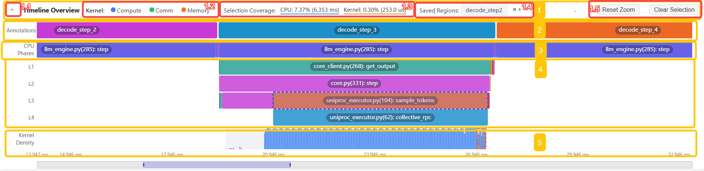

Following the numbering in the image above, `Timeline Overview` can be broken into 5 main regions: `1` is the toolbar, `2`–`5` are the timeline body.

**1. Toolbar**

- `1.1` Collapse / Expand + title
  - The left arrow collapses or expands the entire `Timeline Overview`
  - Useful to reclaim vertical space for downstream views once the selection is done
- `1.2` `Kernel` legend
  - Controls whether `Compute` / `Comm` / `Memory` densities are shown in `Kernel Density`
  - Useful for quickly judging whether a window is compute-, communication-, or memory-heavy
- `1.3` `Selection Coverage`
  - Shows the fraction of total CPU time and kernel time covered by the current selection, plus the absolute duration
  - Helps confirm "is my selection tight enough"; it's not a performance indicator
- `1.4` `Saved Regions`
  - Saves the current selection and quickly restores it via a tab
  - Great for pinning commonly used ranges like `prefill`, `decode_step_2`, `embedding`
- `1.5` `Reset Zoom` / `Clear Selection`
  - `Reset Zoom` only restores the zoom window
  - `Clear Selection` clears the current selection and returns to full-range statistics

**2. `Annotations` row**

- Shows existing business annotations from the trace, e.g. `decode_step_2`, `decode_step_3`
- Best for a "coarse selection": frame a large business phase first, then decide whether to narrow further
- Usually the fastest entry when trace annotations are of good quality

**3. `CPU Phases` row**

- Shows CPU phase-level events, e.g. a specific step or phase function
- Clicking a segment creates a selection and opens a deeper CPU sub-event layer
- Useful when there are no business annotations or the annotations are too coarse

**4. `L1` / `L2` / `L3` / `L4` expansion layers**

- These layers appear only after you click into `CPU Phases`
- Each layer represents one deeper level of CPU sub-events
- Useful for recursively locating specific local modules, e.g. `embedding`, sampling logic, or a sub-operator path
- The layers you rely on when drilling from "big phase" all the way down to "specific code path"

**5. `Kernel Density` row**

- A density bar summarizing kernel activity along the time axis
- Each bucket overlays the ratio of `Compute` / `Comm` / `Memory`
- Good for answering two quick questions:
  - Which window is the busiest and most worth analyzing
  - For the currently selected CPU phase, is the GPU activity dominated by compute, communication, or memory movement

### 1.2 Differences between single-rank and multi-rank


| Aspect             | `Timeline Overview`                                                           | `Multi-Rank Timeline Overview`                                    |
| ------------------ | ----------------------------------------------------------------------------- | ----------------------------------------------------------------- |
| Perspective        | A single rank's local timeline                                                | Multiple ranks' aligned timelines                                 |
| Primary goal       | Narrow down single-rank analysis scope                                        | Compare whether phases are aligned and balanced across ranks      |
| Selection target   | A single time range on the current rank                                       | A set of per-rank selections                                      |
| Downstream effect  | Drives `Overview` / `Operator View` / `Kernel View` / `Memory View`           | Primarily drives `Distributed View` cross-rank statistics and timelines |

### 1.3 `Multi-Rank Timeline Overview` (multi-rank) UI composition


_`Multi-Rank Timeline Overview` UI composition: the image marks the toolbar key areas as `1.1`-`1.5` and the `Multi-Rank Timeline Overview` body as `2`. The explanations below correspond to these numbers._

Following the numbering in the image above, `Multi-Rank Timeline Overview` has two parts: `1` the toolbar, and `2` the `Multi-Rank Timeline Overview` body.

**1. Toolbar**

- `1.1` Collapse / Expand + title
  - The left arrow collapses or expands the entire `Multi-Rank Timeline Overview`
  - Useful to reclaim space for `Distributed View` once phase alignment is done
- `1.2` `Annotations` / `CPU Phases` mode switch
  - `Annotations` is better for aligning by explicit business annotations
  - `CPU Phases` is better for drilling into CPU structural phases
- `1.3` `CPU Depth`
  - Shows the current CPU level and lets you go deeper or go back
  - Useful for recursively locating the same local module across ranks
- `1.4` `Saved Regions`
  - Saves the current multi-rank selection combination and restores via tabs
  - Great for pinning cross-rank aligned ranges such as `prefill`, `decode`
- `1.5` `Reset Zoom` / `Clear Selection`
  - `Reset Zoom` only restores the zoom window
  - `Clear Selection` clears current selections on **all** ranks

**2. `Multi-Rank Timeline Overview` body**

- Multiple timelines for `R0`, `R1`, `R2`, ... shown simultaneously, one per rank
- In `Annotations` mode, align directly by business phase
- In `CPU Phases` mode, compare whether the same CPU phase progresses in sync across ranks
- Blue dashed boxes highlight the current selection on each rank
- The bottom zoom bar controls the visible range of the entire multi-rank window

### 1.4 Common single-rank interactions

Use this for splitting `prefill` / `decode`, inspecting one iteration, analyzing a local module, or narrowing the range before entering `Overview` / `Operator View` / `Kernel View`.

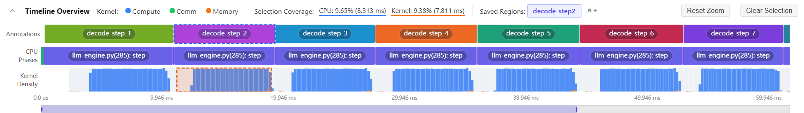

Common interactions:

- **Single select**: left-click a block in `Annotations` or `CPU Phases` to create the current selection.
- **Continuous multi-select**: `Shift + left click` merges the newly clicked range with the existing selection into one continuous range.
- **Drill down**: clicking `CPU Phases` expands `L1` / `L2` / `L3` / `L4` sublayers, which lets you recursively locate a local module such as `embedding` or sampling logic.
- **Zoom and pan**: use `Ctrl + mouse wheel`, `W` / `S` / `A` / `D`, or the bottom zoom bar.
- **Save as tab**: click the add icon on the right side of `Saved Regions` to save the current selection as a reusable tab; click the tab later to restore it.


_Save example: click the plus icon on the right side of `Saved Regions` to save the current selection as a named tab._


_Switch example: click any saved tab to restore its selection. Tabs are useful shortcuts for common ranges such as `prefill`, `decode`, and `embedding`._

`Saved Regions` tabs also support double-click rename and deletion. When you save many regions, use names that identify the phase or module directly, such as `prefill`, `decode_step_2`, or `embedding`.

If a multi-rank trace is loaded but you save a `Timeline Overview` selection from a single-rank view, Tracetto automatically prefixes the name with `R<rank>:`, for example `R0: prefill`. The export dialog uses that prefix to map the selection back to the correct rank.

Notes:

- `Selection Coverage` shows the fraction of total CPU / kernel time covered by the current selection. It is not a performance quality metric.
- `Reset Zoom` only resets the zoom window and does not touch the selection. `Clear Selection` clears the selection and returns statistics to the full range.

### 1.5 Common multi-rank interactions

Use this for aligning `prefill` / `decode` across ranks, focusing on communication-heavy ranges, and analyzing `Distributed View`.

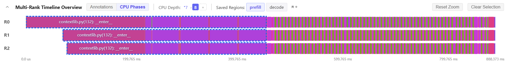

Compared with `Timeline Overview`, the key differences are:

- It shows multiple timelines at once, such as `R0`, `R1`, and `R2`.
- The `Annotations` / `CPU Phases` mode switch decides whether to align by business annotations or drill down by CPU phase.
- `CPU Depth` and breadcrumbs recursively locate the same CPU sub-phase across ranks.
- Each rank keeps its own independent selection highlight, shown as a blue dashed box.
- `Saved Regions` saves the current multi-rank selection combination, not a single-rank range name.
- `Clear Selection` clears selections on all ranks.
- Clicking the exact same block on the same rank again clears that rank's selection.
- Holding `Shift` while clicking a new block on the same rank merges the new range with that rank's existing selection into one continuous range.


_Mode switch example: switch between `Annotations` and `CPU Phases` to choose business-annotation alignment or CPU-phase structural alignment._


_Single-select example: left-click a block on one rank to create an independent selection for that rank. Highlights on different ranks do not interfere with each other._


_Save example: click the plus icon on the right side of `Saved Regions` to save the current multi-rank selection combination as one tab, so you can quickly switch between stages such as `prefill` and `decode`._

### 1.6 Selection propagation and typical flows

Selections are easier to understand in two layers: first decide "which time range should be analyzed" on the timeline, then pass that range to downstream views so they recompute statistics.

**1. Two selection entry points**

| Entry point                    | Applies to                                           | Selection meaning                         |
| ------------------------------ | ---------------------------------------------------- | ----------------------------------------- |
| `Timeline Overview`            | Single-rank analysis, local module analysis, `prefill` / `decode` comparison | One or more time ranges on the current rank |
| `Multi-Rank Timeline Overview` | Multi-rank alignment and communication-heavy range analysis | A set of corresponding time ranges across ranks |

**2. How selections propagate to views**

| Selection source               | Views it drives                                                                                         | After clearing the selection              |
| ------------------------------ | ------------------------------------------------------------------------------------------------------- | ----------------------------------------- |
| Single-rank `Timeline Overview` | `Overview` / `Operator View` / `Kernel View` / `Memory View`; for single-rank files, also `Distributed View` | Returns to full-trace statistics for that rank |
| `Multi-Rank Timeline Overview` | Mainly `Distributed View`, including `Kernel Time Breakdown`, `Communication-Compute Overlap`, `Cross-Rank Kernel Timeline`, `Communication Operator Timeline`, and `Cross-Rank Communication Operator Summary` | Returns to full-range multi-rank aligned statistics |

Note: for multi-rank files, `Distributed View` primarily follows the selection from `Multi-Rank Timeline Overview`; the `Timeline Overview` selection in a single-rank view is mainly used for drilling into that rank's single-view analysis.

**Typical analysis flows**

| Goal                       | Recommended flow                                                                                                                                 |
| -------------------------- | ------------------------------------------------------------------------------------------------------------------------------------------------ |
| Compare `prefill` / `decode` | Select both ranges in `Timeline Overview` and save them as tabs; switch tabs to compare `Overview` / `Operator View` / `Kernel View` statistics |
| Locate a local module       | Drill down through `CPU Phases` to the target module, such as `embedding`; save it as a tab, then use `Operator View` / `Kernel View` / `Memory View` for local analysis |
| Analyze multi-rank distributed bottlenecks | Align the same phase in `Multi-Rank Timeline Overview` and save it as a tab; enter `Distributed View` to analyze communication ranges and cross-rank differences; if needed, return to the corresponding rank's single-view analysis for deeper drill-down |

## 2. Overview in Detail

`Overview` is the first stop for single-rank analysis. It answers "where is GPU time spent" first, then "why is the GPU idle".

### 2.1 Start with `Kernel Time Breakdown`

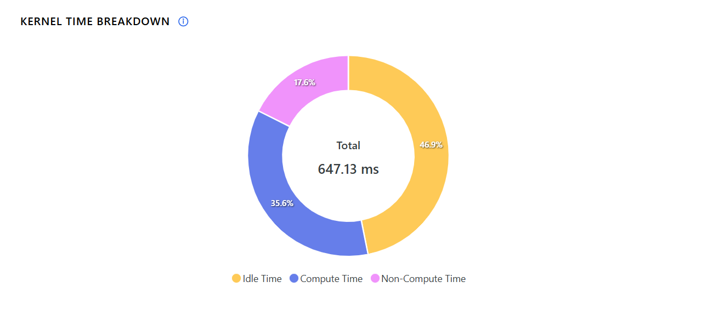

_`Kernel Time Breakdown` example: a ring chart summarizing the ratio of `Idle Time`, `Compute Time` and `Non-Compute Time` within the current analysis range — the first stop for judging where GPU time goes._

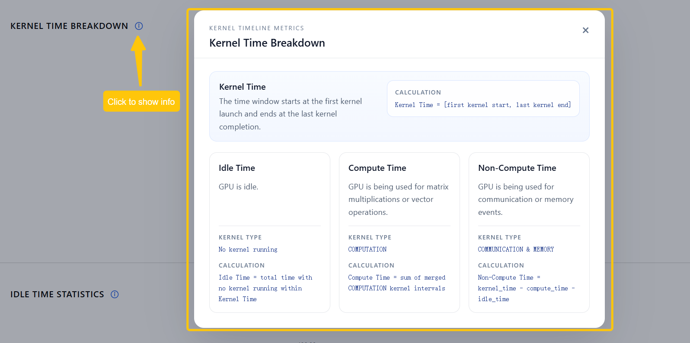

_Help popup: click the info button next to the title to open the metric definitions for `Kernel Time Breakdown`, including the definitions and formulas for `Kernel Time`, `Idle Time`, `Compute Time`, and `Non-Compute Time`._

`Kernel Time` is defined as:

```text
Kernel Time = [first kernel start, last kernel end]
```

Three core metrics:


| Metric              | Meaning                                                             | Computed as                                                         | How to read                                                                                   |
| ------------------- | ------------------------------------------------------------------- | ------------------------------------------------------------------- | --------------------------------------------------------------------------------------------- |
| `Idle Time`         | GPU time with no kernel executing within `Kernel Time`              | Sum of all gaps inside `Kernel Time`                                | High idle usually means upstream submission is slow or there's a gap between phases           |
| `Compute Time`      | Time spent on compute kernels                                       | Merge `COMPUTATION` ranges and sum                                  | A low ratio usually means compute is not saturated                                            |
| `Non-Compute Time`  | Communication- and memory-related time                              | `kernel_time - compute_time - idle_time`                            | A high value warrants first suspicion on communication, memcpy, or data movement              |

Reading guide:

- Compared with other selections in the same trace or with other ranks, if `Compute Time` is clearly lower and `Idle Time` is clearly higher, suspect CPU launch overhead or a pipeline gap first.
- Compared with other ranks in the same phase, if `Non-Compute Time` is clearly higher, inspect communication or memcpy-related views first.
- If `Compute Time` is already dominant but the workload is still slow overall, go to `Operator View` and find the hot operators.

### 2.2 Then check `Idle Time Statistics`

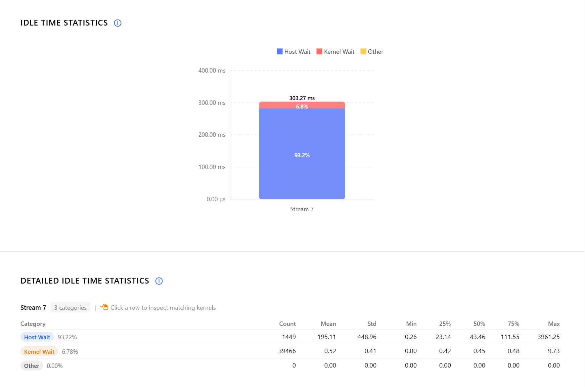

_`Idle Time Statistics` example: aggregated per stream, showing the ratio of `Host Wait`, `Kernel Wait` and `Other` — answers where exactly the GPU idle time comes from._

Idle time is split by stream and category:


| Category       | Meaning                                                      | Common causes                                                           |
| -------------- | ------------------------------------------------------------ | ----------------------------------------------------------------------- |
| `Host Wait`    | CPU isn't submitting work to the GPU fast enough             | Slow CPU-side scheduling, Python/framework overhead, too many small launches |
| `Kernel Wait`  | Small delay between two adjacent GPU kernels                 | Normal launch overhead, stream switching, mild scheduling waits         |
| `Other Wait`   | Waits that don't fit into the two categories above           | More complex dependencies, synchronization, or insufficient trace info  |


_Help popup: click the info button next to `Idle Time Statistics` to see the decision logic and illustrations for `Host Wait`, `Kernel Wait`, and `Other Wait`._

Reading guide:

- If `Host Wait` has the largest share in the current selection, next check `Kernel View > Kernel Launch Statistics`.
- If `Kernel Wait` appears repeatedly across multiple streams, check whether there are many short kernels.
- If `Other Wait` is concentrated in a specific time range, combine `Kernel View` with the timeline for local diagnosis.

#### 2.2.1 Common interactions

- Click an idle statistics row to see kernel details for that group
- Click a kernel in the detail table to open its basic info and call stack on the right

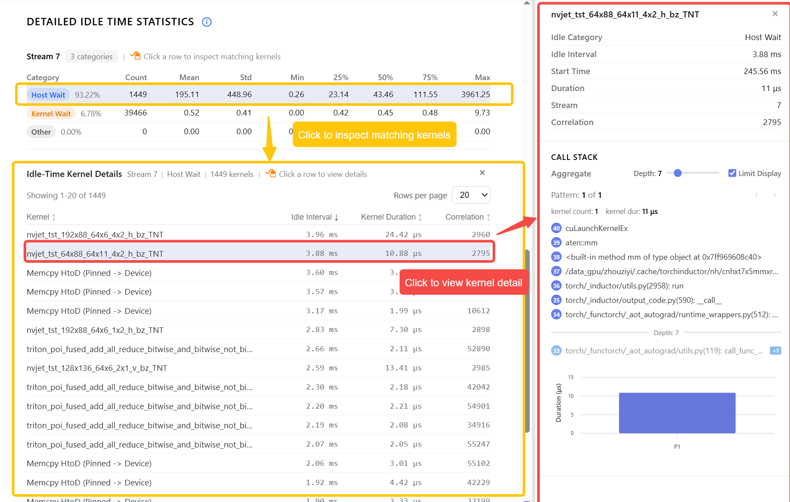

_Drill-down: clicking a row in the idle statistics table shows matching kernel details; clicking a kernel in that detail list opens the basic info and aggregated call stack for that kernel on the right._

## 3. Operator View in Detail

`Operator View` locates hotspots at the framework / operator level — it answers "which op types are the most expensive, and which kernels they correspond to".


_`Operator View`: `1` controls display count; `2` is the hotspot view sorted by `Host Self Duration`, with `2.1` showing CPU-side `Host Duration` and `2.2` showing the corresponding `Kernel Duration`; `3` is the complementary view sorted by `Host Total Duration`._

### 3.1 The two sort orders answer different questions

- `Top Operators sorted by Host Self Duration`
  - "Is this operator itself slow"
  - Better for finding the true hotspot operator
- `Top Operators Sorted by Host Total Duration`
  - "How much total time this operator plus its children took"
  - Better for finding large phases or parent nodes in the call chain

### 3.2 Key metrics


| Metric                | Meaning                                                | Usage                                            |
| --------------------- | ------------------------------------------------------ | ------------------------------------------------ |
| `Host Self Duration`  | `Total Duration - Children Duration`                   | The operator's own cost                          |
| `Host Total Duration` | The operator's total duration on CPU                   | The whole call phase                             |
| `Kernel Duration`     | Total GPU kernel time associated with the operator     | GPU-side cost                                    |
| `Direct Kernels`      | Kernels the operator launches directly                 | One-hop association                              |
| `Descendant Kernels`  | Kernels launched by descendant calls                   | Contribution through the call tree               |

### 3.3 Recommended usage

1. Check Top operators by `Host Self Duration` first
2. Select an operator and view its kernel details
3. Judge whether "the CPU is the slow part" or "the GPU kernels it launches are slow"
4. Click a kernel to continue into the call stack and associated details


_Drill-down: click an operator to see its kernel details; click a kernel in the detail table to see its call stack and aggregated stats on the right._

### 3.4 Common conclusions

- `Host Self Duration` is near the top, but `Kernel Duration` is not: more likely a CPU / framework overhead issue
- `Kernel Duration` is near the top: head to `Kernel View` for kernel type and launch behavior
- `Descendant Kernels` clearly higher than `Direct Kernels`: the hotspot is in deeper child calls

## 4. Kernel View in Detail

`Kernel View` diagnoses problems at the device execution level. It answers things like:

- What kernel types does device time go to
- Are there many short kernels
- Is there a clear HOST (CPU) → device launch delay
- Does a specific stream keep backing up

### 4.1 Kernel Type Distribution


_`Kernel Type Distribution` example: a pie chart summarizing `COMPUTATION`, `MEMORY`, `COMMUNICATION`, etc. within the current selection — quickly judges whether GPU time goes to compute, communication, or memory movement._

Common types include:

- `computation`
- `communication`
- `memory`
- and overlap combinations between them

Reading guide:

- `computation` has the highest share: GPU time is mostly spent on compute kernels
- `communication` is clearly higher than in other selections or ranks: suspect collectives / distributed synchronization first
- `memory` is relatively high: head to `Memory View`

### 4.2 Kernel Details

Displays the top-K kernels by duration and supports click-to-inspect:

- The right panel shows the operator info associated with this kernel
- The aggregated call stack is shown alongside


_`Kernel Details`: `1` controls display count; `2` / `3` / `4` show top-K details for `COMPUTATION`, `MEMORY`, and `COMMUNICATION` kernels respectively._

Good for answering:

- Which kernels are the most expensive
- Which operators triggered them
- Whether the same kernel name recurs along multiple call chains

After clicking a kernel bar, you can dig into the operator info and call stack:

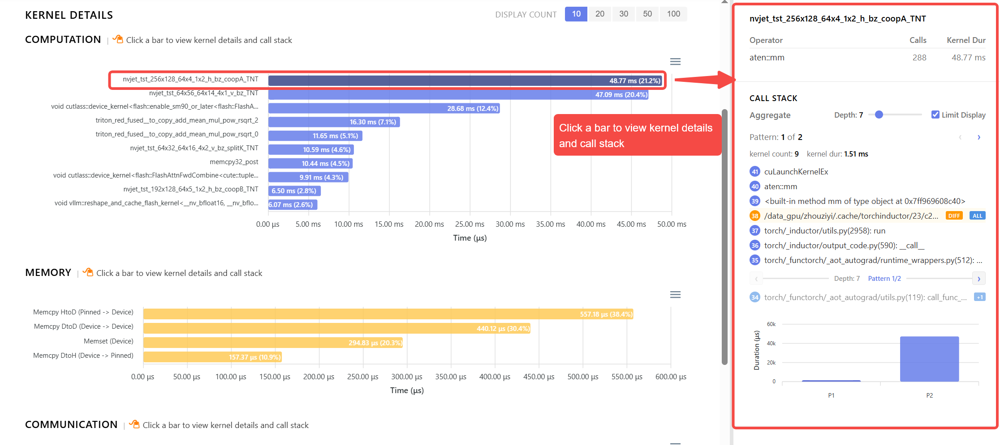

_Drill-down: clicking a kernel bar opens a side panel with the associated operator, call count, kernel duration, and aggregated call stack._

### 4.3 Kernel Launch Statistics

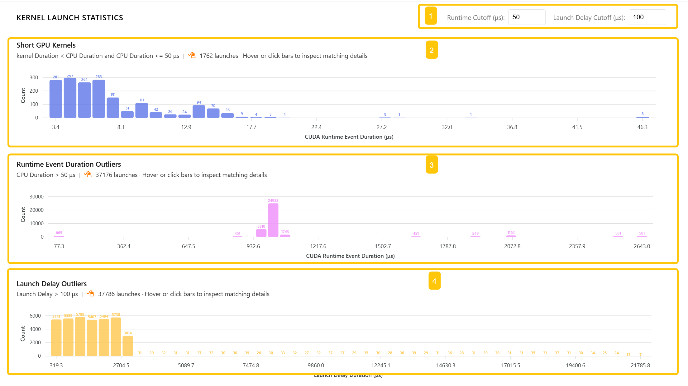

_`Kernel Launch Statistics`: `1` adjusts `Runtime Cutoff` and `Launch Delay Cutoff`; `2` / `3` / `4` show the three anomaly groups `Short GPU Kernels`, `Runtime Event Duration Outliers`, and `Launch Delay Outliers`._

This section analyzes CPU ↔ GPU interaction efficiency. The UI exposes two tunable thresholds:

- `Runtime Cutoff`: default `50 μs`
- `Launch Delay Cutoff`: default `100 μs`

Focus on three anomaly types:


| Anomaly type              | Default rule                                                     | Meaning                                                | Typical optimization direction                              |
| ------------------------- | ---------------------------------------------------------------- | ------------------------------------------------------ | ----------------------------------------------------------- |
| `Short GPU Kernels`       | `GPU Duration < CPU Duration` and `CPU Duration <= 50 μs`        | Kernel is too short — launch overhead dominates        | Merge small kernels, increase per-call work                 |
| `Runtime Event Outliers`  | `CPU Duration > 50 μs`                                           | CPU-side cost of issuing a kernel is abnormal          | Check thread blocking, lock contention, framework scheduling |
| `Launch Delay Outliers`   | `Launch Delay > 100 μs`                                          | CPU submitted, but GPU started executing much later    | Check GPU-busy, dependency chains, stream scheduling        |

Suggestions:

- If `Host Wait` in `Overview` is relatively high, this section often provides more specific evidence
- Click a row in the detail table to see the corresponding CPU launch event, GPU kernel event, and call stack

For deeper drill-down, go from the anomaly distribution chart into the detail table, then into a single launch:

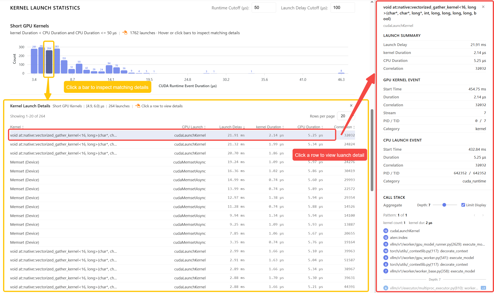

_Drill-down: clicking a bar filters launch details for that range; clicking a row in the detail table opens a side panel showing `Launch Summary`, `GPU Kernel Event`, `CPU Launch Event`, and the call stack._

### 4.4 Kernel Wait Queue


_`Kernel Wait Queue`: `1` is `summary` aggregated by stream; `2` is `kernel wait queue over time`, which shows how queue length changes over time._

`kernel wait queue over time` shows the number of kernels queued on each CUDA stream at any moment.

Rough intuition:

- Launching a kernel increases the queue length
- When the kernel actually starts executing, the queue length decreases

Rule-of-thumb reading:

- Sustained high queue: that stream has persistent backlog
- Many queue spikes: submission cadence may be bursty
- Some streams always empty, others always full: stream usage is imbalanced

After clicking a queue point in `kernel wait queue over time`, the right panel shows that kernel's basic info and call stack.


_Drill-down: clicking a point in `kernel wait queue over time` opens a side panel with the kernel's start time, duration, stream, and aggregated call stack._

## 5. Memory View in Detail

`Memory View` is for diagnosing memcpy and data-movement issues. It answers whether data moves frequently between CPU, GPU, and GPU peers, and whether those moves cluster in specific time ranges.


_`Memory Copy Bandwidth Analysis`: `1` is `Memory Copy Bandwidth Summary`, aggregated by operation type; `2` is `Memory Copy Bandwidth Over Time`, which shows bandwidth over time and supports filtering by memcpy / memset type to locate peak ranges._

`Memory Copy Bandwidth Over Time` shows the bandwidth usage of memory copy events over time, usually in `GB/s`.

Common types:


| Type           | Meaning                 |
| -------------- | ----------------------- |
| `Memset`       | Memory set              |
| `Memcpy HtoD`  | CPU → GPU               |
| `Memcpy DtoH`  | GPU → CPU               |
| `Memcpy DtoD`  | GPU → GPU               |
| `Memcpy PtoP`  | GPU peer-to-peer        |

Reading guide:

- Relatively high `HtoD`: possibly input movement, insufficient prefetch, or host-staging issues
- Relatively high `DtoH`: check for unnecessary result transfers back to host or synchronous reads
- Relatively high `DtoD` / `PtoP`: interpret together with distributed, tensor-parallel, or data-rearrangement context

Clicking a memory event in `Memory Copy Bandwidth Over Time` shows the corresponding kernel details and call stack on the right.

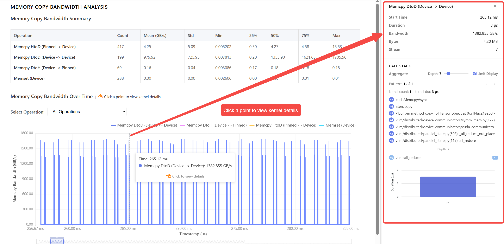

_Drill-down: clicking a memory event in `Memory Copy Bandwidth Over Time` opens a side panel with its start time, duration, bandwidth, payload size, stream, and aggregated call stack._

## 6. Distributed View in Detail

`Distributed View` is only available for multi-rank data. It answers "are ranks balanced, is communication hidden, and which time segment is problematic".

### 6.1 Kernel Time Breakdown

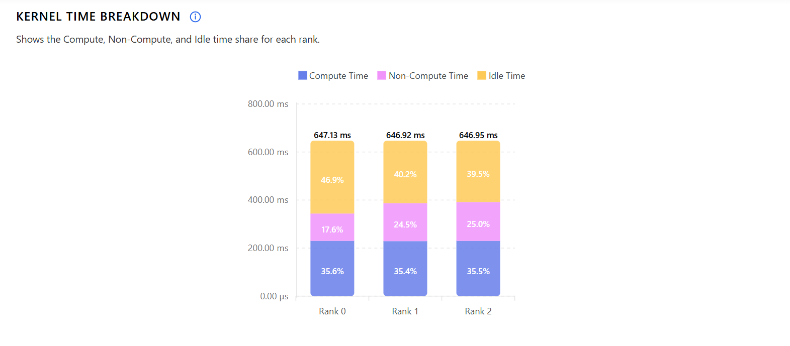

_`Kernel Time Breakdown` example: per-rank breakdown of `Compute Time`, `Non-Compute Time`, and `Idle Time` — quickly judges whether ranks' time breakdowns are consistent._

This is the multi-rank version of `Kernel Time Breakdown`. Start by looking at:

- Which ranks have notably lower `Compute`
- Which ranks have notably higher `Idle`
- Whether ranks have clear differences in time breakdown

If a rank's `Idle` or `Non-Compute` is noticeably higher, continue to `Cross-Rank Kernel Timeline` and `Communication Operator Timeline`.

### 6.2 Communication-Compute Overlap

This block answers "is communication effectively overlapped by compute".


_`Communication-Compute Overlap` example: per-rank, shows how much of the communication time is covered by compute. Higher means better hiding._

Key metric:

```text
Overlap Ratio = overlap_time / communication_time
```

Reading guide:

- Compared with other ranks in the same phase, a relatively higher `Overlap Ratio` means communication is more likely hidden by compute.
- Compared with other phases, a relatively lower `Overlap Ratio` means communication and compute are more likely serialized, so synchronization waits are easier to expose.

### 6.3 Cross-Rank Kernel Timeline


_`Cross-Rank Kernel Timeline` example: per-rank kernel events are colored by `Compute`, `Communication`, `Memory` and laid out on the same time axis — great for observing phase progression, alignment, and serial/parallel relationships._

Kernels from every rank are colored by `Compute / Communication / Memory` and rendered on one time axis.

Useful for:

- Whether ranks progress through the same phase in sync
- Whether a specific rank obviously lags behind
- Whether communication and compute are interleaved or serialized

`Cross-Rank Kernel Timeline` currently does not distinguish streams; same-rank data is aggregated onto a single line.

Clicking a kernel block shows its name, rank, and call stack on the right.


_Drill-down: clicking a kernel block opens a side panel with its name, owning rank, and call stack._

### 6.4 Communication Operator Timeline


_`Communication Operator Timeline` example: colored by communication operator name and showing the exact time location of communication kernels per rank — lets you focus on collectives and communication hotspots._

`Communication Operator Timeline` is dedicated to communication operators:

- Shows the exact time location of communication kernels per rank
- Colored by communication operator name
- Clicking a block locates the same range in `Cross-Rank Kernel Timeline`

When you scroll past `Communication Operator Timeline`, it automatically sticks to the top; click `📌` to toggle the sticky state.

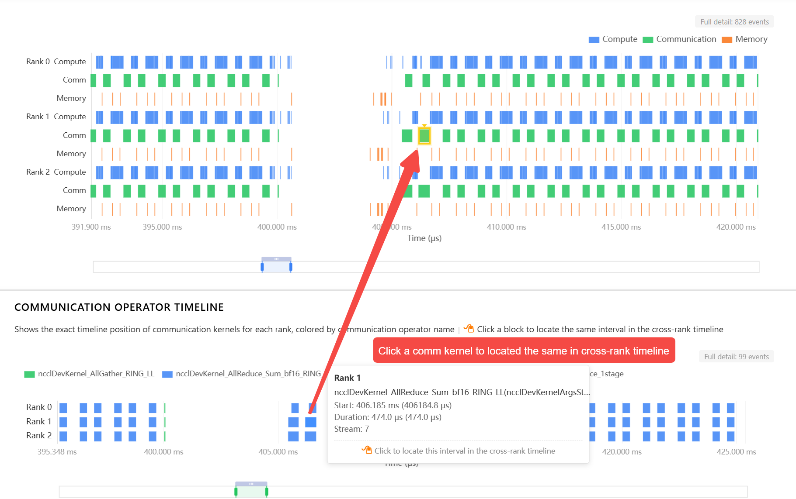

_Linking: clicking a block in `Communication Operator Timeline` brings `Cross-Rank Kernel Timeline` to the same time range, so you can inspect compute and memory events surrounding the communication._

### 6.5 Cross-Rank Communication Operator Summary

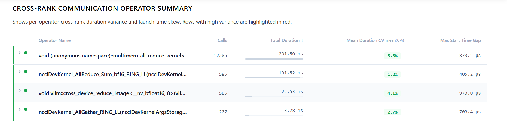

_`Cross-Rank Communication Operator Summary` example: aggregates per-operator cross-rank duration, call counts, mean variability, and launch-time skew — the main table for final attribution._

`Cross-Rank Communication Operator Summary` aggregates across ranks by communication operator name. It is the main table for final attribution:

- Per-rank duration statistics
- Inter-rank duration variance
- Inter-rank synchronization skew

Reading guide:

- A relatively higher `Duration Variance` for a communication operator means that collective is imbalanced across ranks.
- A relatively higher `Launch-Time Skew` means ranks arrive at that communication point out of sync.

If a row is clearly anomalous, go back to `Communication Operator Timeline` and `Cross-Rank Kernel Timeline` to localize the exact range.

Expanding a row reveals three finer-grained sub-tables:


_Detail: expanding a communication operator reveals `Per-Rank Duration Statistics`, `Duration Variance Details`, and `Synchronization Deviation Details`._

Each block answers a different question:

- `Per-Rank Duration Statistics`
  - One row per rank, showing call count, total duration, mean, min, max, and stddev
  - Answers "how large the duration differences are across ranks, and how much they fluctuate"
  - A rank marked `Slowest` has the highest duration for this operator
- `Duration Variance Details`
  - Per call index, shows the duration on each rank and the `CV` across ranks — `CV = σ / μ`, the relative dispersion of the same call across ranks
  - Answers "is this variance persistent, or just a handful of spikes"
  - A few spikes point to local jitter; all rows high points to systematic imbalance
- `Synchronization Deviation Details`
  - Per call, shows the start-time skew and end-time skew across ranks
  - Answers "do ranks arrive at and finish this call in sync"
  - Large start skew suggests upstream compute/scheduling is out of sync; large end skew additionally indicates imbalance in the communication itself

Points in these detail charts can also reverse-link to timeline positions:


_Linking: clicking a point in `Duration Variance Details` or `Synchronization Deviation Details` locates the corresponding call in `Communication Operator Timeline`._

## 7. Call Stack

`Call Stack` is a cross-view side panel component in Tracetto. It answers "from which Python / framework call chain was this kernel / event triggered". In `Overview`, `Operator View`, `Kernel View`, `Memory View`, and `Distributed View`, clicking a concrete kernel bar, a detail row, or a point on a time series all open the same `Call Stack` panel on the right.

Typical entry points include:

- `Overview > Idle Time Statistics`: click a kernel detail under an idle category to see which chain triggered that kernel
- `Operator View`: click an operator's kernel detail row to find the specific operator → kernel call chain
- `Kernel View > Kernel Details / Launch Statistics / Kernel Wait Queue`: click a kernel / launch detail / point in `Kernel Wait Queue`
- `Memory View`: click a memory event on the time series
- `Distributed View > Cross-Rank Kernel Timeline`: click a kernel block to see its rank's call stack

### 7.1 UI composition

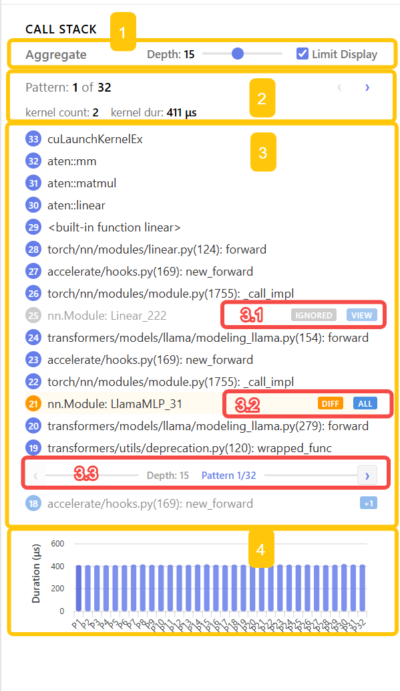

_`Call Stack`: `1` aggregation controls (`Aggregate`, `Depth`, `Limit Display`); `2` the `Pattern` switcher (current pattern index, kernel count, total duration); `3` the aggregated stack list (`3.1` marks `IGNORED` frames whose layer differences are ignored and not aggregated on; `3.2` marks `DIFF` frames where this layer differs across patterns; `3.3` is the level / pattern navigation); `4` a per-instance duration histogram for this kernel under the current pattern._

> The histogram in `4` is also a quick pattern switcher: click a bar to jump to that pattern, and the currently selected bar highlights in sync with `Pattern x of N` in `2` — great for skimming patterns in descending cost order.

Core concepts:

- **Aggregation by layer**: stacks with the same prefix are merged layer by layer, so you don't see the same upper-layer frames repeated across calls of the same kernel. The top-level `Depth` / `Limit Display` controls the maximum displayed depth
- **Pattern (call-chain pattern)**: a kernel may be triggered by different call chains in different contexts; each independent chain is one `pattern`. Tracetto groups stacks by pattern for cross-entry comparison

Rows in the stack list may show two label / action buttons:

| Label     | Meaning                                                    |
| --------- | ---------------------------------------------------------- |
| `IGNORED` | This layer's differences are ignored; this layer's info does not participate in aggregation |
| `DIFF`    | This layer differs across patterns                         |

| Action | What it does                                                 |
| ------ | ------------------------------------------------------------ |
| `view` | Show the layer's information ignored during aggregation **for this pattern** |
| `all`  | Show the layer's information **across all patterns**         |

> `DIFF` / `IGNORED` labels switch whether that layer participates in aggregation-difference matching; `all` / `view` show the concrete values for that layer. In `DIFF` state, click `all` to inspect the layer across all patterns. After switching to `IGNORED`, click `view` to inspect the layer values ignored within the current pattern.

### 7.2 `view`: show this pattern's ignored layer info

Clicking `view` on a row pops up the list of this layer's info that was ignored during aggregation **for the current pattern** — useful for confirming which distinct values this layer has under that pattern.


_`view` popup: clicking `VIEW` on an `IGNORED` row opens a `Pattern N - Layer M Info` panel listing all ignored callstack entries at this layer for this pattern (e.g. `nn.Module: Linear_222` / `nn.Module: Linear_221`)._

Useful for:

- Confirming the ignored differences are expected same-class calls (e.g. multiple `nn.Linear` instances)
- Seeing how many distinct calls are covered by an ignored layer

### 7.3 `all`: show every pattern's layer info

Clicking `all` on a row pops up the layer's info across **all patterns** — useful for comparing the same stack level under different patterns.

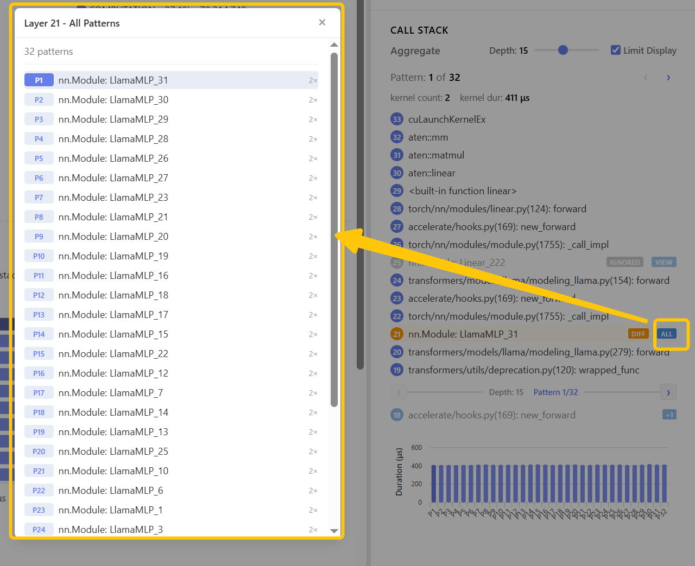

_`all` popup: clicking `ALL` on a `DIFF` row opens a `Layer M - All Patterns` panel enumerating what this layer looks like under each pattern (e.g. `nn.Module: LlamaMLP_*` per pattern)._

Useful for:

- Judging whether the same kernel is shared by multiple parent modules or recurs along one specific chain only
- For multi-expert / multi-layer models, distinguishing which expert / which layer a kernel came from

### 7.4 Recommended usage

1. From the corresponding view (`Operator` / `Kernel` / `Memory` / `Distributed` / `Overview > Idle`), click into a kernel and look at the default aggregated view to find the primary call chain
2. Read `Pattern x of N`: if `N == 1`, this kernel comes from a single chain; if `N > 1`, first use `‹ ›` to browse the duration distribution across patterns
3. For `IGNORED` layers of interest, click `view` to see this pattern's ignored info and confirm it matches expectations
4. For layers marked `DIFF`, click `all` to see the info under all patterns and pinpoint the specific layer / expert / module
5. Adjust `Depth` and `Limit Display` at the top to switch between primary-chain view and full-stack view

### 7.5 Common conclusions

- Single pattern + concentrated cost: the call path is unique; optimization focuses on the module on this chain
- Multiple patterns + similar cost each: the kernel is shared by multiple modules; optimizing the kernel itself has broader benefit
- Multiple patterns + one clearly more expensive: a specific chain is problematic; use `DIFF` layers to narrow down the specific module
- `IGNORED` layer covers many same-class instances: usually a loop / stacked structure (such as many transformer blocks) where this layer's difference is ignored — an expected pattern

### 7.6 Walkthrough: multi-layer Transformer / multi-expert MoE

Two walkthroughs below map the abstract `IGNORED` / `DIFF` / `pattern` concepts onto concrete operations in common model structures.

#### Scenario A: a recurring GEMM kernel in a multi-layer Transformer

Typical signs: from `Operator View`, click `aten::mm` and open `Call Stack`. The top-right shows `Pattern 1 of 1` (or `N` is large and durations across patterns are similar), and every bar in the duration histogram sits near the same level.

Steps:

1. In the default aggregated view, you'll see a row marked `IGNORED` whose content looks like `nn.Module: TransformerBlock_*`
2. This is the expected aggregation pattern: distinct transformer blocks have different instances at this layer (`TransformerBlock_0` / `TransformerBlock_1` / ...), but they all share the same downstream chain, so the layer difference is ignored
3. Click `view` on that row; the popup lists all ignored instances at this layer for this pattern — confirm coverage across all layers
4. Combined with `kernel count` and `kernel dur` in `2`, you can infer how many layers stack up to produce this GEMM's total cost

Conclusion direction: the kernel is healthy; optimization should target fewer layers / smaller hidden dim / a faster GEMM — not "find a specific chain that's wrong".

#### Scenario B: one expert in an MoE model is abnormally slow

Typical signs: in `Kernel View > Kernel Details`, click an expert kernel and open `Call Stack`. `Pattern x of N` has `N` equal to the number of experts, and one bar in the `4` histogram is clearly higher than the rest.

Steps:

1. Click the tallest bar directly; the main panel's `Pattern x of N` jumps to that pattern
2. In the stack list, find a `DIFF`-marked row whose content looks like `nn.Module: Expert_*` or `nn.Module: LlamaMLP_*`
3. Click `all` on that row; the popup enumerates this layer's instance per pattern — you can see which `expert_id` corresponds to the tall bar
4. Switch to other bars to confirm that the same kernel is shorter on the other experts

Conclusion direction: one persistently slow expert usually maps to load imbalance (routing skew), shape-induced launch jitter, or a different downstream chain triggered by that expert. Combined with that expert's `Direct Kernels` / `Descendant Kernels` in `Operator View`, you can localize the issue to a specific operator or sub-module.

> In both scenarios, clicking `view` on `IGNORED` rows and `all` on `DIFF` rows are toggleable on the same row. Combined with the histogram in `4`, you can quickly switch between "primary-chain overview → single-pattern detail → cross-pattern comparison".

## 8. Export Analysis Data

Tracetto can export the current trace's analysis results to offline files — useful for archiving, comparison, writing reports, or follow-up processing in other tools. The export entry is the download icon at the top-right of the page (on the same row as the `Overview / Operator / Kernel / Memory / Distributed` tab bar).


_`Export Analysis Data`: `1` export type and format (`Data Export` / `Generate Report`, plus the corresponding `Format`); `2` rank and time-range selection (per-rank checkbox, with chips for `All Data` or a saved selection); `3` analysis sections to include (`Overview: Summary` / `Overview: Idle` / `Kernel view` / `Operator view` / `Memory view` / `Distributed view`)._

### 8.1 Two export types

The `Data Export` / `Generate Report` toggle at the top picks the export style:

| Type              | Use case                                                                   | Available formats        |
| ----------------- | -------------------------------------------------------------------------- | ------------------------ |
| `Data Export`     | Export analysis as structured data — easy for follow-up processing or storage | `Excel` / `JSON` / `CSV` |
| `Generate Report` | Produce a human-readable analysis report — suitable for archiving, sharing | `Markdown` / `HTML`      |

Format notes:

- `JSON`: produced directly by the C++ engine; most complete structure; all sections in one file
- `CSV`: one table per section, good for Excel / Pandas follow-up
- `Excel`: fetches `JSON` first, then the front-end converts to a multi-sheet `.xlsx`
- `Markdown`: produced directly by the C++ engine as a report document
- `HTML`: combines Markdown + JSON data to produce an offline report with charts

### 8.2 Selecting ranks and time ranges

The `Export Ranks` area decides which ranks to export, and which time range per rank.

- **Multi-rank files**: one row per rank with a checkbox in front; available time-range chips laid out below
- **Single-rank files**: a simple `Data Range` chip area is shown, no rank checkboxes

Sources of the chips on each row:

- `All Data`: no time filter; exports the entire rank's data
- Single-rank saved selections: come from `Saved Regions` in `Timeline Overview`
- Selections with a `(Distributed)` suffix: come from multi-rank selections saved in `Multi-Rank Timeline Overview`; exported with the corresponding rank's time range
- `Current Selection: ...`: an unsaved temporary selection. If the current selection exactly matches a saved region, it doesn't appear separately — the saved chip shows a `●` marker indicating it's the active one instead

`Select All` / `Clear All` at the bottom quickly check / uncheck all ranks.

### 8.3 Selecting included sections

`Included Sections` controls which blocks of analysis to include in the export file — they correspond 1:1 with page tabs:

- `Overview: Summary` — summaries in `Overview` such as `Kernel Time Breakdown`
- `Overview: Idle` — `Idle Time Statistics`
- `Kernel view` — kernel type distribution, details, launch, wait queue
- `Operator view` — operator hotspot ranking and kernel association
- `Memory view` — memory event statistics and time series
- `Distributed view` — multi-rank communication / compute metrics (only effective on multi-rank files)

At least one section must be selected to enable `Export`.

### 8.4 Recommended usage

- Offline comparison / storage: `Data Export` + `JSON`, keep all sections
- Detail analysis for Excel users: `Data Export` + `Excel` or `CSV`
- Performance reports: `Generate Report` + `HTML` (with charts) or `Markdown` (plain text, easy to embed)
- Multi-rank cross-phase comparison: save `prefill` / `decode` regions in `Multi-Rank Timeline Overview` first, then in the export dialog pick different `Distributed` selections per rank and export multiple groups in one go

### 8.5 Notes

- A progress bar appears in the dialog during export; don't close the page in between
- Large files + all sections + Excel are slower than `JSON` / `CSV` because the front-end has to convert JSON into `.xlsx`
- `Distributed view` is usually empty on single-rank files; uncheck it
- Selections only affect "time-filterable sections" (kernel / operator / memory); global summaries still use full per-rank statistics

## 9. Common Analysis Scenarios (Cookbook)

This section gives high-frequency analysis paths. When you face a typical problem, do not browse every view from the beginning. Use the corresponding path below: each flow narrows the selection first, then uses cross-view evidence for diagnosis.

### 9.1 Prefill / Decode comparison

For comparing different stages of large-model inference or training.

Suggested flow:

1. Select `prefill` and `decode` separately in `Timeline Overview`
2. Save them as two selection tabs
3. Inspect each:
   - `Overview`: which has higher `Idle` / `Non-Compute`
   - `Operator View`: which hot operators differ
   - `Kernel View`: which has more fragmented launches and deeper queues
4. Go to `Call Stack` and compare whether the hot kernels come from different modules

### 9.2 Local module analysis

For pinpointing local paths like `embedding`, `ffn`, `vit`, a specific block, or a specific expert.

Suggested flow:

1. Drill layer-by-layer into the target module via `CPU Phases`
2. Save a selection tab for that module
3. Activate the tab, then inspect `Operator View` / `Kernel View` / `Memory View`
4. If the same kernel name appears in multiple modules, use `Pattern` and `DIFF` information in `Call Stack` to distinguish the exact source

### 9.3 Multi-rank communication anomalies

When you suspect a specific collective or rank is slowing things down:

1. `Distributed View > Kernel Time Breakdown`
2. `Distributed View > Communication-Compute Overlap`
3. `Distributed View > Cross-Rank Kernel Timeline`
4. `Distributed View > Communication Operator Timeline`
5. `Distributed View > Cross-Rank Communication Operator Summary`

### 9.4 Low GPU utilization

Use this when the GPU is often idle but the trace does not show one obvious hot operator.

Suggested flow:

1. Select the low-utilization range in `Timeline Overview`
2. Enter `Overview` and confirm whether `Idle Time` is relatively high
3. If `Host Wait` has the largest share, go to `Kernel View > Kernel Launch Statistics`
4. If `Kernel Wait` or `Kernel Wait Queue` is clearly abnormal, continue with `Kernel Wait Queue`
5. Click the abnormal point to open `Call Stack`, then locate which call chain triggered the fragmented kernels or waits

### 9.5 Fragmented CPU launches

Use this for traces with many short kernels or high CPU launch overhead.

Suggested flow:

1. First confirm in `Overview` whether `Host Wait` is relatively high
2. Enter `Kernel View > Kernel Launch Statistics`
3. Inspect `Short GPU Kernels`, `Runtime Event Outliers`, and `Launch Delay Outliers`
4. Click an anomaly distribution to enter the details, then click a specific row to open the CPU launch event and GPU kernel event
5. Use `Call Stack` to determine whether these short kernels come from the same operator, module, or loop structure

### 9.6 Communication is not hidden by compute

Use this for serialized communication and compute, degraded overlap, or a rank waiting for other ranks.

Suggested flow:

1. Align the same phase in `Multi-Rank Timeline Overview`
2. Enter `Distributed View > Communication-Compute Overlap` and compare `Overlap Ratio` across ranks
3. In `Cross-Rank Kernel Timeline`, check whether communication and compute are interleaved
4. In `Communication Operator Timeline`, click the suspicious communication block and locate the surrounding kernel range
5. In `Cross-Rank Communication Operator Summary`, confirm whether the issue is duration imbalance or asynchronous arrival at the communication point

## 10. FAQ

This section summarizes the most common import, parse, and multi-rank usage issues. Check it first, then decide whether to return to a specific view for deeper inspection.

### 10.1 No results after picking a file, or parse failure

Check first:

- Is the file a PyTorch Profiler-exported `.json` / `.json.gz`
- Is it corrupted or incompletely exported
- Is the file size beyond the current browser's processing limit
- Were too many large files imported at once

For very large files:

- Prefer a recent Chrome with Memory64 support
- Close other browser tabs

### 10.2 Can `.json.gz` be used directly

Yes. The web UI auto-detects and decompresses `.json.gz`.

### 10.3 How is rank order determined for multi-rank files

On the import page:

- The file list order is the rank order
- Rows can be drag-reordered
- Rank numbers on the analysis pages follow this order

If the file name already contains `rank_0 / rank_1 / ...`, we still recommend confirming the order manually once.
