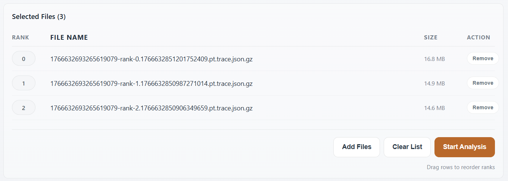
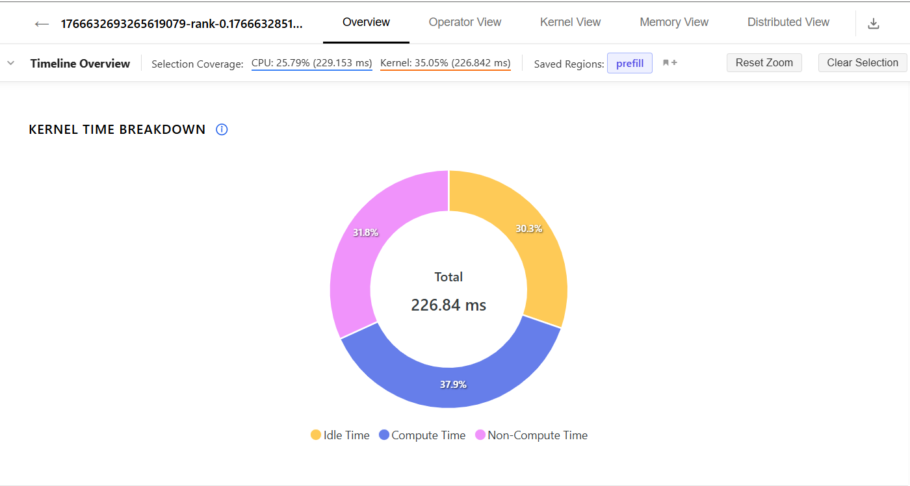
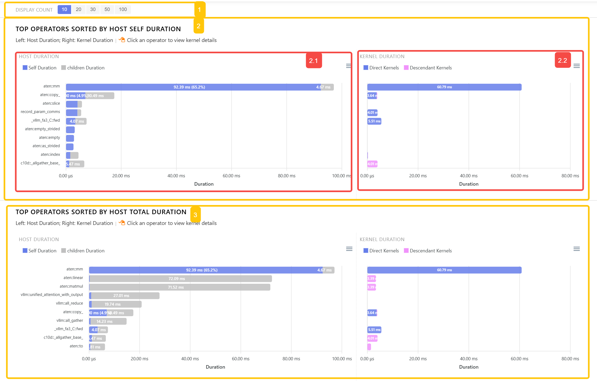
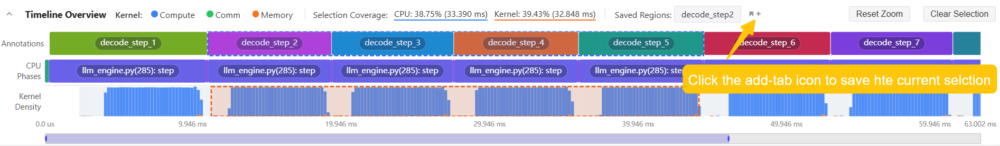

# Tracetto 用户手册

**语言 / Language:** 简体中文 | [English](../en/quickstart.md)

面向算法 / 性能工程师，使用 Web 界面分析 PyTorch Profiler trace。

Tracetto 是面向 PyTorch Profiler 的浏览器端分析工具，不只是「打开 trace」，而是帮助你快速回答这些性能问题：

- GPU 时间主要耗在计算、通信、内存搬运还是空闲
- 哪些 operator 和 kernel 是真正的热点
- CPU launch 是否拖慢了 GPU
- 多 rank 是否负载不均，通信是否被计算有效重叠（overlap）
- 某个阶段或模块是否是主要瓶颈

Tracetto 在浏览器端本地解析 trace，无需上传数据，安全快速。


_Tracetto 浏览器导入页：访问 [https://www.tracetto.com/](https://www.tracetto.com/)，选择 trace 文件即可在浏览器内本地解析。_

> **本手册的目标**：让你在 10 分钟内完成第一次端到端分析。各视图的字段定义、所有交互细节、典型场景与常见问题，请见 [reference.md](./reference.md)。
>
> **前置假设**：你已熟悉 PyTorch Profiler 的基本采集流程，对 CUDA stream、kernel、collective 通信等概念有基本认知。如果完全没有 PyTorch 性能分析经验，建议先读 PyTorch 官方 Profiler 教程再回来。

## 与 Perfetto 配合使用

Tracetto **不是 Perfetto 的替代品**，两者面向不同层次的问题，建议在分析流程中配合使用：


| 工具       | 解决的问题           | 强项                                                                                                 |
| ---------- | -------------------- | ---------------------------------------------------------------------------------------------------- |
| `Tracetto` | 整体哪里慢、为什么慢 | 自动统计`Compute / Non-Compute / Idle` 占比、operator / kernel 热点排序、聚合调用栈、多 rank overlap |
| `Perfetto` | 这一刻具体发生了什么 | 像素级时间线、CPU / GPU 事件逐条展开、流间依赖箭头、自由 SQL 查询                                    |

**推荐工作流**：先用 Tracetto 在 `Timeline Overview` 框出可疑阶段，把怀疑收敛到具体的 operator / kernel / collective；再用 Perfetto 打开同一份 trace，跳到该时间区间做微观验证。两者使用同一份 PyTorch Profiler trace，无需重复采集。

口诀：**Tracetto 回答「哪里 / 为什么慢」，Perfetto 回答「具体怎么发生」**。

## 目录

- [1. 快速开始](#1-快速开始)
  - [1.1 生成可导入的 trace 文件](#11-生成可导入的-trace-文件)
  - [1.2 访问 Tracetto](#12-访问-tracetto)
  - [1.3 导入文件](#13-导入文件)
- [2. 分析主界面介绍](#2-分析主界面介绍)
- [3. 第一次端到端分析](#3-第一次端到端分析)
- [4. 按问题选择分析路径](#4-按问题选择分析路径)
- [5. Timeline Overview 与选区管理（速查）](#5-timeline-overview-与选区管理速查)
- [6. 继续阅读](#6-继续阅读)

## 1. 快速开始

### 1.1 生成可导入的 trace 文件

直接导出 PyTorch Profiler 的 Chrome Trace 格式：

```python
import torch
from torch.profiler import profile, ProfilerActivity

with profile(
    activities=[ProfilerActivity.CPU, ProfilerActivity.CUDA],
    record_shapes=True,
    profile_memory=True,
    with_stack=True
) as prof:
    model(input_data)
    loss.backward()
    optimizer.step()

prof.export_chrome_trace("trace.json")
```

对于 vLLM / SGLang 这类推理服务，可以直接使用框架内置的 PyTorch Profiler 开关生成同类 trace。

#### vLLM 服务场景

服务端通过 `--profiler-config` 打开 PyTorch Profiler，再用 `vllm bench serve --profile` 触发一次短压测。

官方文档：[Profiling vLLM](https://docs.vllm.ai/en/stable/contributing/profiling/)

```bash
# Terminal 1：启动 vLLM OpenAI server
vllm serve meta-llama/Llama-3.1-8B-Instruct \
    --profiler-config '{"profiler": "torch", "torch_profiler_dir": "./vllm_profile", "torch_profiler_record_shapes": true, "torch_profiler_with_memory": true}'

# Terminal 2：触发 profiling workload
vllm bench serve \
    --backend vllm \
    --model meta-llama/Llama-3.1-8B-Instruct \
    --dataset-name sharegpt \
    --dataset-path sharegpt.json \
    --profile \
    --num-prompts 2
```

采集结束后，从 `./vllm_profile` 中选择生成的 `.pt.trace.json` 或 `.pt.trace.json.gz` 文件导入 Tracetto。请求数量尽量少，否则 trace 会迅速变大。

#### SGLang 服务场景

服务端和压测端都设置 `SGLANG_TORCH_PROFILER_DIR`，避免 trace 写到不同目录：

官方文档：[Benchmark and Profiling](https://docs.sglang.io/docs/developer_guide/benchmark_and_profiling)

```bash
# Terminal 1：启动 SGLang server
export SGLANG_TORCH_PROFILER_DIR=./sglang_profile
python -m sglang.launch_server \
    --model-path meta-llama/Llama-3.1-8B-Instruct

# Terminal 2：触发 profiling workload
export SGLANG_TORCH_PROFILER_DIR=./sglang_profile
python -m sglang.bench_serving \
    --backend sglang \
    --model meta-llama/Llama-3.1-8B-Instruct \
    --num-prompts 2 \
    --sharegpt-output-len 100 \
    --profile
```

采集结束后，从 `./sglang_profile` 中选择生成的 `.trace.json` 或 `.trace.json.gz` 文件导入 Tracetto。SGLang PD 分离部署中，prefill / decode worker 需要分别采集，可在 `bench_serving --profile --pd-separated` 中指定 `--profile-prefill-url` 或 `--profile-decode-url`。

### 1.2 访问 Tracetto

最终用户无需本地启动站点，直接访问 [https://www.tracetto.com/](https://www.tracetto.com/) 即可进入导入页。

### 1.3 导入文件

- **单文件**：拖拽或选择一个 `.json` / `.json.gz` 文件，页面会自动解析并跳转分析页
- **多文件**：选择多个文件后，在确认列表中拖拽行调整顺序；列表顺序就是 rank 顺序，确认后点击 `Start Analysis`
- **大文件**：浏览器是否支持 Memory64 决定上限。前端当前限制为：
  - 标准模式：原始 `.json` 约 2.5 GB
  - Memory64 模式：原始 `.json` 约 10 GB



_多文件导入列表：确认顺序后点击 `Start Analysis`，文件按列表顺序映射为 rank 0、rank 1、rank 2 …_

## 2. 分析主界面介绍

导入 trace 后会进入分析主界面。主界面上方负责文件与视图切换，中间的 `Timeline Overview` 负责全局定位和选区，下方是当前视图的统计图表与明细。


_Tracetto 分析主界面：`1` 文件区，`2` 视图导航与导出入口，`3` 全局时间线与选区管理，`4` 当前分析视图。_

- **1 文件区**：显示当前打开的 trace 文件名，左侧返回按钮可回到导入页重新选择文件。
- **2 视图导航与导出入口**：在 `Overview`、`Operator View`、`Kernel View`、`Memory View`、`Distributed View` 之间切换；右侧下载图标用于导出分析数据或报告。
- **3 Timeline Overview**：用于选择感兴趣的区域来进行后续的分析，是所有分析视图的时间范围入口；在这里选择阶段或时间段后，下方视图会随选区刷新。
- **4 当前分析视图**：展示当前页签的分析图表；例如 `Overview` 中会展示 `Kernel Time Breakdown`、`Idle Time Statistics` 等整体统计。

各视图的定位如下：


| 视图               | 主要用途                                       | 分析图表 / 面板介绍                                                                                                                                                                                                                                                                                                                                        |
| ------------------ | ---------------------------------------------- | ---------------------------------------------------------------------------------------------------------------------------------------------------------------------------------------------------------------------------------------------------------------------------------------------------------------------------------------------------------- |
| `Overview`         | 单 rank 分析的第一站，判断 GPU 时间整体分布    | `Kernel Time Breakdown`：用环图汇总 `Compute / Non-Compute / Idle` 占比。<br>`Idle Time Statistics`：按 stream 拆分 `Host Wait`、`Kernel Wait`、`Other Wait`，定位 GPU 空闲来源。                                                                                                                                                                          |
| `Operator View`    | 从 PyTorch operator 层面定位热点               | `Top Operators sorted by Host Self Duration`：operator 自身热点。<br>`Top Operators Sorted by Host Total Duration`：operator完整调用的热点。<br>operator kernel 明细：查看该 operator 触发的 kernel。                                                                                                                                                      |
| `Kernel View`      | 从 GPU kernel 层面排查执行与调度问题           | `Kernel Type Distribution`：按类型汇总计算、通信、内存相关 kernel 占比。<br>`Kernel Details`：展示各类型 Top-K kernel。<br>`Kernel Launch Statistics`：分析短 kernel、runtime 异常和 launch delay。<br>`Kernel Wait Queue`：观察各 stream 的 kernel 排队情况。                                                                                             |
| `Memory View`      | 排查 memcpy 与数据搬运瓶颈                     | `Memory Copy Bandwidth Summary`：按 memcpy / memset 类型汇总带宽。<br>`Memory Copy Bandwidth Over Time`：展示带宽随时间变化，用于定位搬运峰值和异常区间。                                                                                                                                                                                                  |
| `Distributed View` | 多 rank 数据下分析负载均衡、通信与 overlap     | `Kernel Time Breakdown`：对比各 rank 的计算、非计算和空闲占比。<br>`Communication-Compute Overlap`：评估通信被计算覆盖的程度。<br>`Cross-Rank Kernel Timeline`：对齐观察各 rank 的 kernel 推进。<br>`Communication Operator Timeline`：聚焦通信算子的时间位置。<br>`Cross-Rank Communication Operator Summary`：汇总通信算子的跨 rank 耗时偏差和同步偏差。 |
| `Call Stack` 侧栏  | 从具体 kernel / event 追到 Python 或框架调用链 | 聚合调用栈：展示 kernel / event 的 Python 或框架调用来源。<br>`Pattern` 耗时分布：对比同一 kernel 在不同调用链模式下的耗时。<br>`view` / `all` 弹窗：查看聚合过程中被忽略或存在差异的栈帧信息。                                                                                                                                                            |

Tracetto 中所有支持缩放的图表（`Timeline Overview`、`Kernel Wait Queue`、`Memory Copy Bandwidth Over Time`、`Cross-Rank Kernel Timeline` 等）共享同一套键鼠交互。


| 操作             | 作用                                                                                |
| ---------------- | ----------------------------------------------------------------------------------- |
| Ctrl + 鼠标滚轮  | 在当前图表内放大 / 缩小时间窗口                                                     |
| W/S              | 等价于放大 / 缩小当前时间窗口                                                       |
| A/D              | 向左 / 向右平移当前时间窗口                                                         |
| 鼠标左键         | 选中色块 / 条形 / 时间序列点；通常会打开右侧明细或`Call Stack` 侧栏                 |
| Shift + 鼠标左键 | 在`Timeline Overview` / `Multi-Rank Timeline Overview` 中把新点击区间合并入现有选区 |
| 鼠标拖拽         | 在缩放后的视窗里平移；或拖动底部缩放条改变可见范围                                  |

> 键盘控制需要先点击目标图表，让它成为当前活动图表；否则按 `W·S·A·D` 不会生效。

各视图特有的下钻交互（点击 operator → kernel 明细、点击 kernel → `Call Stack` 等）请见对应章节，[reference.md](./reference.md) 中也有详细说明。

## 3. 第一次端到端分析

第一次面对一份 trace 不知从何下手，按下面这条路径走一遍即可跑通最短闭环。下面以「prefill / decode 两阶段对比」为例，定位 prefill 阶段中的算子热点。

**Step 1 — 在 `Timeline Overview` 里选定 prefill 阶段**

在 `Timeline Overview` 中选定本次要分析的 prefill 范围，可以按图中的步骤操作：

- 按图中步骤 `1`：点击 `prefill` 对应的 `Annotations` 或 `CPU Phases` 区间；如果 prefill 包含多个连续片段，按住 `Shift` 继续点击，把它们合并到同一个选区
- 确认上方 `Selection Coverage` 已更新，说明后续视图会基于当前选区重新统计
- 按图中步骤 `2`：在 `Saved Regions` 中输入 `prefill` 并保存为页签，后续可随时切回该页签恢复同一分析范围


_在 `Timeline Overview` 中选定 prefill 区间并保存为 `prefill` 页签，后续所有视图都会按该选区刷新统计结果。_

**Step 2 — 到 Overview，看 kernel 时间分布是否健康**

进入 `Overview`：

- 先看 `Kernel Time Breakdown`：`Compute / Non-Compute / Idle` 哪一块相对偏高
- 如果 `Idle` 相对偏高，再看 `Idle Time Statistics`：到底是 `Host Wait`、`Kernel Wait` 还是 `Other Wait`



**Step 3 — 到 Operator View，定位耗时第一的算子**

进入 `Operator View` 后，可以按图中的区域顺序阅读：

- 先看 `2` 区域：这是按 `Host Self Duration` 排序的热点视图，用来找 operator 自身耗时最高的项。图中 `aten::mm` 的 `Host Self Duration` 为 `92.39 ms`，占比 `65.2%`，是当前 prefill 选区里最突出的 operator
- 再结合 `2.2` 区域：右侧 `Kernel Duration` 显示 `aten::mm` 对应的 kernel 总耗时为 `60.79 ms`，说明它不仅 CPU 侧显著，也是 GPU 侧的主要热点；如果某个 operator 只有 `Host Self Duration` 靠前、`Kernel Duration` 很低，则更像是 CPU / 框架开销
- 最后看 `3` 区域：这是按 `Host Total Duration` 排序的对照视图，用来判断热点是否来自更大的父调用或完整调用阶段
- 如果想查看更多候选 operator，可在 `1` 区域调整 `DISPLAY COUNT`



_`Operator View` 界面示意图：`1` 用于设置显示数量，`2` 是按 `Host Self Duration` 排序的热点视图（`2.1` 展示 CPU 侧 `Host Duration`，`2.2` 展示对应 `Kernel Duration`），`3` 是按 `Host Total Duration` 排序的对照视图。_

**Step 4 — 在 Operator 行查看它触发的 kernel**

点击 `aten::mm` 行后，下方会展开它直接关联的 kernel 明细。可以按下面的顺序读：

- 先看汇总信息：图中 `aten::mm` 一共有 `581 calls`，对应 `60.79 ms kernel`
- 再看各 kernel 占比：第一行 `nvjet_tst_256x128_64x4_1x2_h_bz_coopA_TNT` 调用 `288` 次，耗时 `48.77 ms`，占 `aten::mm` kernel 总耗时的 `80.2%`
- 对比后续 kernel：第二、三行分别是 `6.50 ms (10.7%)` 和 `3.00 ms (4.9%)`，明显低于第一行
- 因此后续优先围绕第一行 kernel 展开分析；点击该 kernel 行后，右侧侧栏会展示它的聚合统计与 `Call Stack`


**Step 5 — 用 Call Stack 找到调用源头**

`Call Stack` 面板会展示该 kernel 是从哪条 Python / 框架调用链触发的。可以按图中的区域顺序阅读：

- 先看 `4` 区域：耗时分布柱图里 `P2` 明显高于 `P1`，说明应优先分析 `Pattern 2`；如果当前不是 `P2`，可直接点击 `P2` 柱形切到该 pattern
- 再结合 `2` 区域确认：当前是 `Pattern 2 of 2`，对应 `279` 次 kernel 调用，总耗时 `47.26 ms`，几乎覆盖了该 kernel 的主要耗时
- 最后看 `3` 区域：这里是 `Pattern 2` 的聚合调用栈。注意调用栈展示为逆序，顶部是最终的 `cuLaunchKernelEx`，继续往下看才能看到 `aten::mm`、torch inductor / dynamo 等上游框架调用来源
- 如果调用栈太深或展示过多，可在 `1` 区域调整 `Depth` / `Limit Display`

看 `Pattern x of N` 时可以按下面的方式判断：

- 如果 `N == 1`：调用路径单一，问题就在这条链上
- 如果 `N > 1`：在 `4` 区域的耗时分布柱图中点击最高的柱，跳到对应 pattern，分析耗时最高的调用栈


_`Call Stack` 界面：`1` 聚合控制（`Depth` / `Limit Display`），`2` 当前 pattern 编号与 kernel 数量 / 总耗时，`3` 聚合调用栈列表（含 `DIFF` 标记的层），`4` 当前 kernel 各 pattern 的耗时分布柱图；示例中 `P2` 明显高于 `P1`，可直接点击柱形切到该 pattern。_

**Step 6 — 对 decode 选区重复同样的流程，做横向对比**

按照Step 1选择并保存的 `decode` 页签，再走一遍 Step 2 ~ Step 5。两边的 Top 算子 / 调用链差异，往往就是 prefill 与 decode 性能差异的根因。

> 想看每一步背后字段的精确含义，或某个图表的更深用法（例如 `Kernel Launch Statistics` 的三类异常、`Distributed View` 的 overlap、`Call Stack` 的多 expert / 多 layer 案例），请翻阅 [reference.md](./reference.md) 对应章节。

## 4. 按问题选择分析路径

不要「从左到右把所有图都看一遍」，按问题类型进入对应视图：


| 你的问题                            | 第一站             | 重点看什么                                                         | 下一步                                                                                                         |
| ----------------------------------- | ------------------ | ------------------------------------------------------------------ | -------------------------------------------------------------------------------------------------------------- |
| GPU 利用率为什么低                  | `Overview`         | `Compute / Non-Compute / Idle` 占比、`Idle Time Statistics`        | `Kernel View` 看 launch / queue                                                                                |
| 哪个算子最耗时                      | `Operator View`    | `Host Self Duration` 与 `Host Total Duration` 排名                 | 点击 operator，下钻到 kernel /`Call Stack`                                                                     |
| 是否存在过多小 kernel 或调度问题    | `Kernel View`      | `Kernel Launch Statistics`、`Kernel Wait Queue`                    | 结合`Overview` 的 `Host Wait`                                                                                  |
| 是否是 memcpy / 数据搬运问题        | `Memory View`      | `Memory Copy Bandwidth Summary`、`Memory Copy Bandwidth Over Time` | 回看`Kernel View` 与 `Overview`                                                                                |
| 多 rank 是否不均衡 / 通信是否被隐藏 | `Distributed View` | `Kernel Time Breakdown`、`Communication-Compute Overlap`           | `Cross-Rank Kernel Timeline` / `Communication Operator Timeline` / `Cross-Rank Communication Operator Summary` |

经验路径：

- **单 rank**：先看 `Overview`，再看 `Operator View`，必要时进入 `Kernel View` / `Memory View`
- **多 rank**：先看 `Distributed View`，定位到具体 rank 或时间段，再回单 rank 视图做细节分析

## 5. Timeline Overview 与选区管理

`Timeline Overview` 与 `Multi-Rank Timeline Overview` 是所有分析视图的**数据入口**：先用它们缩小分析范围，再把选区传给下方视图。


| 入口                           | 适用范围与选区作用                                                                                                                                    |
| ------------------------------ | ----------------------------------------------------------------------------------------------------------------------------------------------------- |
| `Timeline Overview`            | 用于单 rank 分析，例如拆 `prefill` / `decode`、查看某个 iteration、定位局部模块；选区会传给 `Overview` / `Operator View` / `Kernel View` / `Memory View`，以及单 rank 文件下的 `Distributed View` |
| `Multi-Rank Timeline Overview` | 用于多 rank 对齐和聚焦通信密集区；选区主要驱动 `Distributed View`                                                                                     |

最常用三种交互：

- **单选**：左键点击 `Annotations` 或 `CPU Phases` 中的色块即生成选区
- **连续多选**：`Shift + 左键` 把新区间合并入已有选区
- **保存页签**：点击 `Saved Regions` 右侧加号图标，把当前选区存为命名页签（如 `prefill` / `decode` / `embedding`），后续切换页签即可恢复



注意：

- `Selection Coverage` 显示当前选区覆盖全部 CPU / kernel 时间的比例，**不是性能优劣指标**
- `Reset Zoom` 只恢复缩放，不会改动选区；`Clear Selection` 才会清空选区回到全量

> 工具栏每个按钮的具体含义、`L1` / `L2` / `L3` / `L4` 下钻层、单 / 多 rank 常用交互、选区如何传递到其他视图，详见 [reference.md §1 Timeline Overview 详解](./reference.md#1-timeline-overview-详解)。

## 6. 继续阅读

读到这里，你已经具备跑通一次端到端分析的能力。需要更深入的内容，请按需翻阅 [reference.md](./reference.md)：

- [Timeline Overview 详解](./reference.md#1-timeline-overview-详解) — `Timeline Overview` / `Multi-Rank Timeline Overview` 的工具栏与各行字段逐项说明
- [Overview 详解](./reference.md#2-overview-详解) — `Kernel Time Breakdown` 与 `Idle Time Statistics` 的字段定义、判断方法
- [Operator View 详解](./reference.md#3-operator-view-详解) — 两种排序的差异、`Direct/Descendant Kernels` 的含义
- [Kernel View 详解](./reference.md#4-kernel-view-详解) — kernel类型分布、明细、launch 三类异常、`Kernel Wait Queue`
- [Memory View 详解](./reference.md#5-memory-view-详解) — `Memory Copy Bandwidth Summary` / `Memory Copy Bandwidth Over Time`
- [Distributed View 详解](./reference.md#6-distributed-view-详解) — `communication-compute overlap`、`Cross-Rank Kernel Timeline`、`Communication Operator Timeline`、`Cross-Rank Communication Operator Summary`
- [Call Stack](./reference.md#7-call-stack) — `IGNORED` / `DIFF` / `pattern` 概念，多 layer Transformer 与多 expert MoE 场景演练
- [Export Analysis Data](./reference.md#8-export-analysis-data) — `Data Export` / `Generate Report` 两种导出类型与各格式差异
- [常见分析场景（Cookbook）](./reference.md#9-常见分析场景cookbook) — Prefill/Decode 对比、低 GPU 利用率、CPU launch 过碎、多 rank 通信异常
- [常见问题（FAQ）](./reference.md#10-常见问题faq) — 解析失败、`.json.gz`、多 rank 顺序等
