# Tracetto 参考手册

**语言 / Language:** 简体中文 | [English](../en/reference.md)

[← 返回 quickstart.md](./quickstart.md)

本文是 Tracetto 的「按视图查」参考手册，内容按页面视图与分析场景组织。建议在用 `quickstart.md` 跑通一次端到端分析后，把本文作为日常查阅资料使用。

如果你是第一次接触 Tracetto，请先阅读 [quickstart.md](./quickstart.md)。

## 目录

- [1. Timeline Overview 详解](#1-timeline-overview-详解)
- [2. Overview 详解](#2-overview-详解)
- [3. Operator View 详解](#3-operator-view-详解)
- [4. Kernel View 详解](#4-kernel-view-详解)
- [5. Memory View 详解](#5-memory-view-详解)
- [6. Distributed View 详解](#6-distributed-view-详解)
- [7. Call Stack](#7-call-stack)
- [8. Export Analysis Data](#8-export-analysis-data)
- [9. 常见分析场景（Cookbook）](#9-常见分析场景cookbook)
- [10. 常见问题（FAQ）](#10-常见问题faq)

## 1. Timeline Overview 详解

`Timeline Overview` 与 `Multi-Rank Timeline Overview` 是所有分析视图的**数据入口**：它们把选区传递给 `Overview / Operator View / Kernel View / Memory View / Distributed View`。如果你只想快速上手，请先看 [quickstart.md §5 Timeline Overview 与选区管理](./quickstart.md#5-timeline-overview-与选区管理速查)；如果要查工具栏和每一行的含义，请继续阅读本节。

### 1.1 `Timeline Overview`（单 rank）界面组成


按照上图的编号，可以把 `Timeline Overview` 拆成 5 个主区域，其中 `1` 是工具栏，`2` 到 `5` 是时间线主体。

**1. 工具栏**

- `1.1` 折叠/展开按钮 + 标题
  - 左侧箭头用于折叠或展开整个 `Timeline Overview`
  - 适合在你已经完成选区后，给下方分析视图腾出更多空间
- `1.2` `Kernel` 图例
  - 用来控制 `Kernel Density` 中 `Compute` / `Comm` / `Memory` 三类密度是否显示
  - 适合快速判断当前时间段是计算密集、通信密集还是内存搬运密集
- `1.3` `Selection Coverage`
  - 显示当前选区覆盖全部 CPU 时间、Kernel 时间的比例和绝对时长
  - 用途是帮助你确认“选得够不够准”，不是性能优劣指标
- `1.4` `Saved Regions`
  - 用来保存当前选区，并通过页签快速恢复
  - 适合固定保存 `prefill`、`decode_step_2`、`embedding` 等常用区间
- `1.5` `Reset Zoom` / `Clear Selection`
  - `Reset Zoom` 只恢复缩放窗口
  - `Clear Selection` 清空当前选区，回到全量统计

**2. `Annotations` 行**

- 展示 trace 中已有的业务标注，例如 `decode_step_2`、`decode_step_3`
- 最适合做“粗选区”：先按业务阶段框出一大段，再决定是否继续细化
- 如果 trace 标注质量较好，通常这是最快的入口

**3. `CPU Phases` 行**

- 展示 CPU 阶段级事件，例如某个 step 或某个阶段函数
- 点击某一段时，会同时创建选区，并进入更深一层 CPU 子事件分析
- 适合在没有业务标注、或者业务标注不够细时继续缩小范围

**4. `L1` / `L2` / `L3` / `L4` 展开层**

- 这些层级只会在你点击 `CPU Phases` 后逐步出现
- 每一层都表示更深一级的 CPU 子事件
- 适合递归定位到具体局部模块，例如 `embedding`、采样逻辑、某个子算子路径
- 如果你想从“大阶段”一路走到“具体代码路径”，主要依赖这些层级

**5. `Kernel Density` 行**

- 用密度条概览当前时间轴上 kernel 的活跃程度
- 每个时间桶会叠加显示 `Compute` / `Comm` / `Memory` 的占比
- 适合快速回答两个问题：
  - 哪一段时间最忙、最值得分析
  - 当前选中的 CPU 阶段，对应的 GPU 活动是计算、通信还是内存搬运为主

### 1.2 单 rank 与多 rank 的差异


| 维度     | `Timeline Overview`                                              | `Multi-Rank Timeline Overview`                    |
| -------- | ---------------------------------------------------------------- | ------------------------------------------------- |
| 视角     | 单个 rank 的局部时间线                                           | 多个 rank 的对齐时间线                            |
| 主要目标 | 缩小单 rank 分析范围                                             | 比较 rank 间阶段是否对齐、是否失衡                |
| 选择对象 | 当前 rank 的单一时间范围                                         | 各 rank 各自的选区集合                            |
| 结果用途 | 驱动`Overview` / `Operator View` / `Kernel View` / `Memory View` | 主要驱动`Distributed View` 的跨 rank 统计和时间线 |

### 1.3 `Multi-Rank Timeline Overview`（多 rank）界面组成

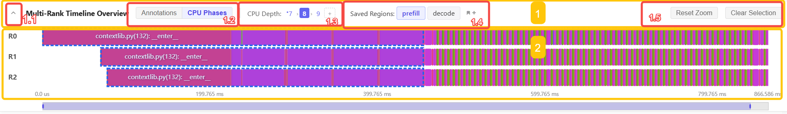

_多 rank `Multi-Rank Timeline Overview` 界面组成示意图：图中已经按 `1.1` 到 `1.5` 标出工具栏关键区域，并用 `2` 标出 `Multi-Rank Timeline Overview` 主体。下面的说明与这些编号一一对应。_

按照上图的编号，可以把 `Multi-Rank Timeline Overview` 拆成两部分：`1` 是工具栏，`2` 是 `Multi-Rank Timeline Overview` 主体。

**1. 工具栏**

- `1.1` 折叠/展开按钮 + 标题
  - 左侧箭头用于折叠或展开整个 `Multi-Rank Timeline Overview`
  - 适合在你已经完成阶段对齐后，给 `Distributed View` 腾出更多可视空间
- `1.2` `Annotations` / `CPU Phases` 模式切换
  - `Annotations` 适合按显式业务标注对齐阶段
  - `CPU Phases` 适合按 CPU 结构化阶段继续下钻
- `1.3` `CPU Depth`
  - 用来显示当前 CPU 层级，并通过当前层级继续深入或返回
  - 适合在多 rank 下递归定位同一个局部模块
- `1.4` `Saved Regions`
  - 保存当前多 rank 选区组合，并通过页签快速恢复
  - 适合固定保存 `prefill`、`decode` 等跨 rank 对齐区间
- `1.5` `Reset Zoom` / `Clear Selection`
  - `Reset Zoom` 只恢复缩放窗口
  - `Clear Selection` 会清空所有 rank 当前选区

**2. `Multi-Rank Timeline Overview` 主体**

- 以 `R0`、`R1`、`R2` 等多条时间线同时展示不同 rank 的阶段分布
- 在 `Annotations` 模式下，适合按业务阶段直接对齐
- 在 `CPU Phases` 模式下，适合比较同一层 CPU 阶段在各 rank 上是否同步推进
- 蓝色虚线框表示当前各 rank 的选区高亮
- 底部缩放条用于控制整个多 rank 时间窗的可见范围

### 1.4 单 rank 常用交互

适用场景：拆 `prefill` / `decode`、只看某个 iteration、只分析某个局部模块、在进入 `Overview` / `Operator View` / `Kernel View` 前先缩小范围。


最常用的几种交互：

- **单选**：左键点击 `Annotations` 或 `CPU Phases` 中的色块，立即生成当前选区
- **连续多选**：`Shift + 左键` 把新点击区间和已有选区合并成一个连续范围
- **下钻**：点击 `CPU Phases` 后会展开 `L1` / `L2` / `L3` / `L4` 子层，递归定位到具体局部模块（如 `embedding`、采样逻辑等）
- **缩放与平移**：`Ctrl + 鼠标滚轮` / `W·S·A·D` / 拖动底部缩放条
- **保存为页签**：点击 `Saved Regions` 右侧的添加图标，把当前选区保存为可复用页签；后续点击页签即可恢复


_保存示意图：点击 `Saved Regions` 右侧的加号图标，可以把当前选区保存为一个命名页签。_

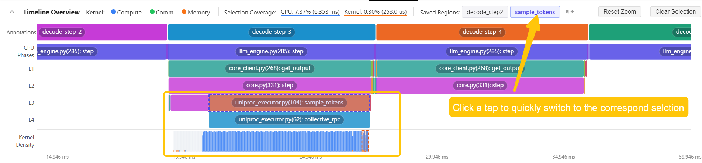

_切换示意图：点击任一已保存页签，可快速恢复到对应选区；页签可作为 `prefill` / `decode` / `embedding` 等常用区间的快捷入口。_

`Saved Regions` 页签还支持双击重命名和删除。保存数量较多时，建议使用能直接说明阶段或模块的名称，例如 `prefill`、`decode_step_2`、`embedding`。

如果当前加载的是多 rank 数据，但你在某个单 rank 视图中保存 `Timeline Overview` 选区，Tracetto 会在名称前自动加上 `R<rank>:` 前缀，例如 `R0: prefill`。导出弹窗会用这个前缀把选区匹配到对应 rank。

需要注意：

- `Selection Coverage` 显示的是「当前选区覆盖全部 CPU / kernel 时间的比例」，不是性能优劣指标
- `Reset Zoom` 只恢复缩放，不会改动选区；`Clear Selection` 才会清空选区回到全量

### 1.5 多 rank 常用交互

适用场景：跨 rank 对齐 `prefill` / `decode`、聚焦通信密集区、做 `Distributed View` 分析。


与 `Timeline Overview` 相比，关键差异是：

- 同时展示 `R0`、`R1`、`R2` 等多条时间线
- 通过 `Annotations` / `CPU Phases` 模式切换，决定按业务标注对齐还是按 CPU 阶段下钻
- `CPU Depth` 和面包屑用来在多 rank 下递归定位同一层 CPU 子阶段
- 不同 rank 各自保留独立的选区高亮（蓝色虚线框）
- `Saved Regions` 保存的是「当前多 rank 选区组合」，不是单 rank 区间名称
- `Clear Selection` 会清空所有 rank 的选区
- 在同一 rank 上再次点击完全相同的色块，会清除该 rank 的选区
- 按住 `Shift` 点击同一 rank 的新色块，会把新区间与该 rank 的已有选区合并成连续范围


_模式切换示意图：在 `Annotations` 与 `CPU Phases` 之间切换，决定按业务标注对齐还是按 CPU 阶段结构对齐。_

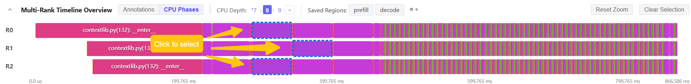

_单选示意图：左键点击某个 rank 上的色块即可为该 rank 创建独立选区，不同 rank 的高亮范围互不影响。_

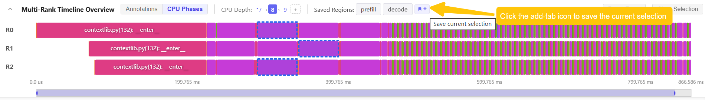

_保存示意图：点击 `Saved Regions` 右侧的加号图标，把当前多 rank 选区组合整体保存为一个页签，便于在 `prefill` / `decode` 等阶段间快速切换。_

### 1.6 选区传递与典型流程

选区的作用可以分成两层理解：先在时间线上确定“要分析哪段”，再把这段时间范围传给下方视图重新统计。

**1. 两类选区入口**

| 入口                           | 适用场景                                         | 选区含义                         |
| ------------------------------ | ------------------------------------------------ | -------------------------------- |
| `Timeline Overview`            | 单 rank 分析、局部模块分析、prefill / decode 对比 | 当前 rank 上的一段或多段时间范围 |
| `Multi-Rank Timeline Overview` | 多 rank 对齐、通信密集区分析                      | 多个 rank 各自对应的时间范围集合 |

**2. 选区如何传递到视图**

| 选区来源                       | 会驱动哪些视图                                                                                          | 清空选区后                         |
| ------------------------------ | ------------------------------------------------------------------------------------------------------- | ---------------------------------- |
| 单 rank `Timeline Overview`    | `Overview` / `Operator View` / `Kernel View` / `Memory View`；单 rank 文件下也会驱动 `Distributed View` | 回到该 rank 的全量 trace 统计      |
| `Multi-Rank Timeline Overview` | 主要驱动 `Distributed View`，包括 `Kernel Time Breakdown`、`Communication-Compute Overlap`、`Cross-Rank Kernel Timeline`、`Communication Operator Timeline`、`Cross-Rank Communication Operator Summary` | 回到多 rank 的全量对齐统计         |

需要注意：多 rank 文件下，`Distributed View` 以 `Multi-Rank Timeline Overview` 的选区为主；某个单 rank 视图里的 `Timeline Overview` 选区，主要用于该 rank 的单视图下钻。

**典型分析流程**

| 目标                      | 推荐流程                                                                                                                                 |
| ------------------------- | ---------------------------------------------------------------------------------------------------------------------------------------- |
| 对比 `prefill` / `decode` | 在 `Timeline Overview` 中分别选中两段并保存为页签；切换页签对比 `Overview` / `Operator View` / `Kernel View` 的统计差异                 |
| 定位局部模块              | 在 `CPU Phases` 中逐层下钻到目标模块，例如 `embedding`；保存为页签后，再进入 `Operator View` / `Kernel View` / `Memory View` 做局部分析 |
| 分析多 rank 分布式瓶颈    | 在 `Multi-Rank Timeline Overview` 中对齐同一阶段并保存页签；进入 `Distributed View` 分析通信区间和跨 rank 差异；必要时回到对应 rank 的单视图继续下钻 |

## 2. Overview 详解

`Overview` 是单 rank 分析的第一站。它先回答“GPU 时间花在哪儿”，再回答“GPU 为什么空闲”。

### 2.1 先看 `Kernel Time Breakdown`


_`Kernel Time Breakdown` 示例：用环图汇总 `Idle Time`、`Compute Time` 和 `Non-Compute Time` 在当前分析范围内的占比，是判断 GPU 时间主要花在哪里的第一站。_


_帮助弹窗示意图：点击标题右侧的信息按钮，可以打开 `Kernel Time Breakdown` 的指标说明，查看 `Kernel Time`、`Idle Time`、`Compute Time` 和 `Non-Compute Time` 的定义与计算方式。_

这里的 `Kernel Time` 定义为：

```text
Kernel Time = [第一个 kernel 开始, 最后一个 kernel 结束]
```

三个核心指标：


| 指标               | 含义                                             | 计算方式                                 | 如何解读                                             |
| ------------------ | ------------------------------------------------ | ---------------------------------------- | ---------------------------------------------------- |
| `Idle Time`        | GPU 在`Kernel Time` 内没有执行任何 kernel 的时间 | `Kernel Time` 内所有空档时间之和         | 相对偏高时，通常表示上游提交不及时或阶段之间存在空转 |
| `Compute Time`     | 计算型 kernel 占用的时间                         | 合并`COMPUTATION` 区间后求和             | 相对偏低时，通常说明计算没有占满主要时间             |
| `Non-Compute Time` | 通信和内存相关时间                               | `kernel_time - compute_time - idle_time` | 相对偏高时，优先怀疑通信、memcpy 或数据搬运          |

判断方法：

- 与同一 trace 的其他选区或其他 rank 对比。如果 `Compute Time` 明显更低、`Idle Time` 明显更高，先怀疑 CPU launch 或流水线断档
- 与同一阶段的其他 rank 对比。如果 `Non-Compute Time` 明显更高，优先查看通信或 memcpy 相关视图
- 如果 `Compute Time` 已经占主要部分但整体仍慢，进入 `Operator View` 找热点算子

### 2.2 再看 `Idle Time Statistics`


_`Idle Time Statistics` 示例：按 stream 汇总 `Host Wait`、`Kernel Wait` 和 `Other` 的时间占比，用来回答 GPU 空闲究竟来自哪里。_

空闲时间会按 stream 和类别拆分：


| 类别          | 含义                             | 常见原因                                   |
| ------------- | -------------------------------- | ------------------------------------------ |
| `Host Wait`   | CPU 没有足够快地向 GPU 提交工作  | CPU 侧调度慢、Python/框架开销、launch 过碎 |
| `Kernel Wait` | 两个相邻 GPU kernel 之间的小延迟 | 正常 launch 开销、流切换或轻微调度等待     |
| `Other Wait`  | 不能归入以上两类的等待           | 更复杂的依赖、同步或 trace 信息不足        |

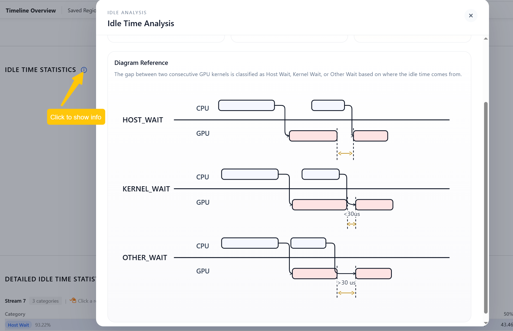

_帮助弹窗示意图：点击 `Idle Time Statistics` 标题右侧的信息按钮，可以查看 `Host Wait`、`Kernel Wait` 和 `Other Wait` 的判定逻辑与示意图。_

判断方法：

- 如果当前选区中 `Host Wait` 占比最高，下一步看 `Kernel View > Kernel Launch Statistics`
- 如果 `Kernel Wait` 在多个 stream 中反复出现，检查是否存在大量短 kernel
- 如果 `Other Wait` 集中在某个时间段，结合 `Kernel View` 和时间线做局部定位

#### 2.2.1 常用交互

- 点击某个 idle 统计行，可以查看该组对应的 kernel 详情
- 点击明细表中的某个 kernel，可以在右侧打开 kernel 基本信息和调用栈


_下钻示意图：点击某一类 idle 统计行后，可以查看匹配的 kernel 明细；再点击明细中的某个 kernel，右侧侧栏会展示该 kernel 的基本信息和聚合调用栈。_

## 3. Operator View 详解

`Operator View` 从框架 / 算子层面定位热点，回答“哪些 operator 最贵，它们对应哪些 kernel”。


_`Operator View` 界面示意图：`1` 用于设置显示数量，`2` 是按 `Host Self Duration` 排序的热点视图，其中 `2.1` 展示 CPU 侧 `Host Duration`，`2.2` 展示对应的 `Kernel Duration`；`3` 是按 `Host Total Duration` 排序的对照视图。_

### 3.1 两种排序分别回答不同问题

- `Top Operators sorted by Host Self Duration`
  - 用来看“这个 operator 自身慢不慢”
  - 更适合找真正的热点算子
- `Top Operators Sorted by Host Total Duration`
  - 用来看“这个 operator 连同子调用一共占了多少时间”
  - 更适合找调用链上的大阶段或父节点

### 3.2 关键指标


| 指标                  | 含义                                   | 用法                 |
| --------------------- | -------------------------------------- | -------------------- |
| `Host Self Duration`  | `Total Duration - Children Duration`   | 看 operator 自身开销 |
| `Host Total Duration` | operator 在 CPU 上的总持续时间         | 看完整调用阶段       |
| `Kernel Duration`     | 该 operator 关联到的 GPU kernel 总时间 | 判断 GPU 侧代价      |
| `Direct Kernels`      | operator 直接触发的 kernel             | 看一跳关联           |
| `Descendant Kernels`  | 子孙调用链触发的 kernel                | 看调用树贡献         |

### 3.3 推荐阅读顺序

1. 先按 `Host Self Duration` 看耗时最高的 operator
2. 选中某个 operator，查看其 kernel 明细
3. 判断是“CPU 本身慢”，还是“它触发的 GPU kernel 慢”
4. 点击 kernel 继续看调用栈和关联信息


_下钻示意图：先点击某个 operator 查看其 kernel 明细，再点击明细表中的某个 kernel，右侧侧栏会展示该 kernel 的调用栈和聚合统计。_

### 3.4 常见结论

- `Host Self Duration` 靠前，但 `Kernel Duration` 不靠前：更像 CPU / 框架开销问题
- `Kernel Duration` 靠前：去 `Kernel View` 看 kernel 类型和 launch 行为
- `Descendant Kernels` 明显高于 `Direct Kernels`：说明热点在更深层的子调用链

## 4. Kernel View 详解

`Kernel View` 从 GPU device 执行层面分析问题，适合回答下面几类问题：

- GPU device 时间主要花在什么类型的 kernel 上
- 是否存在大量短 kernel
- CPU 到 GPU device 的 launch 是否有明显延迟
- 某个 stream 是否长期排队

### 4.1 Kernel Type Distribution

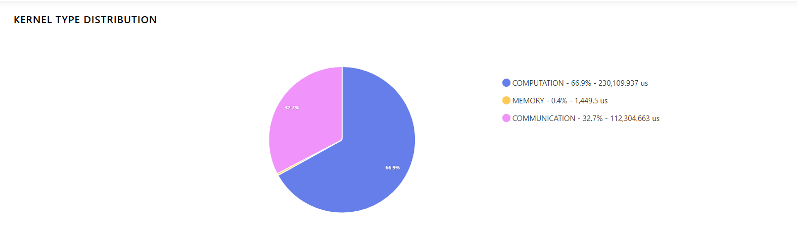

_`Kernel Type Distribution` 示例：用饼图汇总当前选区内 `COMPUTATION`、`MEMORY`、`COMMUNICATION` 等 kernel 类型占比，用来快速判断 GPU 时间主要耗在计算、通信还是内存搬运。_

常见类型包括：

- `computation`
- `communication`
- `memory`
- 以及它们之间的 overlap 组合

判断方法：

- `computation` 占比最高：GPU 主要时间花在计算 kernel 上
- `communication` 相对其他选区或 rank 明显偏高：优先怀疑 collective / 分布式同步
- `memory` 相对偏高：优先查看 `Memory View`

### 4.2 Kernel Details

这里会按耗时展示 Top-K kernel，并支持点击某个 kernel：

- 右侧显示该 kernel 关联的 operator 信息
- 同时展示聚合调用栈

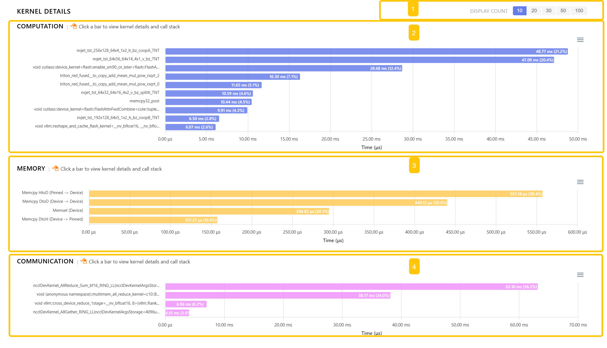

_`Kernel Details` 界面示意图：`1` 用于设置显示数量，`2` / `3` / `4` 分别展示 `COMPUTATION`、`MEMORY`、`COMMUNICATION` 三类 kernel 的 Top-K 明细。_

适合回答：

- 最耗时的是哪些 kernel
- 它们是由哪些 operator 触发的
- 同名 kernel 是否在多个调用链中反复出现

点击某个 kernel 条形后，可以进一步查看该 kernel 对应的 operator 信息和调用栈：


_下钻示意图：点击某个 kernel 条形后，右侧侧栏会展示该 kernel 关联的 operator、调用次数、kernel duration，以及聚合调用栈。_

### 4.3 Kernel Launch Statistics


_`Kernel Launch Statistics` 界面示意图：`1` 用于调节 `Runtime Cutoff` 和 `Launch Delay Cutoff`，`2` / `3` / `4` 分别对应 `Short GPU Kernels`、`Runtime Event Duration Outliers`、`Launch Delay Outliers` 三类异常统计。_

这一部分用来分析 CPU 和 GPU 之间的交互效率。当前界面支持调节两个阈值：

- `Runtime Cutoff`：默认 `50 μs`
- `Launch Delay Cutoff`：默认 `100 μs`

重点关注三类异常：


| 异常类型                 | 默认判定                                                  | 含义                              | 典型优化方向                    |
| ------------------------ | --------------------------------------------------------- | --------------------------------- | ------------------------------- |
| `Short GPU Kernels`      | `GPU Duration < CPU Duration` 且 `CPU Duration <= 50 μs` | kernel 太短，launch 开销占比高    | 合并小 kernel、增加单次工作量   |
| `Runtime Event Outliers` | `CPU Duration > 50 μs`                                   | CPU 侧发起 kernel 时开销异常      | 排查线程阻塞、锁竞争、框架调度  |
| `Launch Delay Outliers`  | `Launch Delay > 100 μs`                                  | CPU 已提交，但 GPU 很久才开始执行 | 排查 GPU 忙、依赖链、流调度问题 |

判断方法：

- 如果 `Overview` 中 `Host Wait` 相对偏高，这里通常能给出更具体的证据
- 点击明细表中的某一行，可以查看对应 CPU launch 事件、GPU kernel 事件以及调用栈

进一步下钻时，可以从异常分布图进入明细表，再进入单条 launch 详情：


_下钻示意图：点击某个柱状条后，会筛出对应区间的 launch 明细；再点击明细表中的某一行，右侧侧栏会同时展示 `Launch Summary`、`GPU Kernel Event`、`CPU Launch Event` 和调用栈。_

### 4.4 Kernel Wait Queue

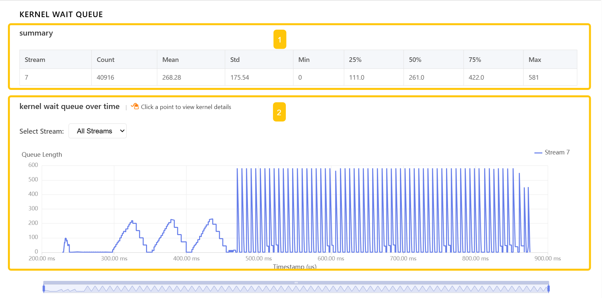

_`Kernel Wait Queue` 界面示意图：`1` 是按 stream 汇总的 `summary`，`2` 是 `kernel wait queue over time`，用来观察队列长度随时间的变化。_

`kernel wait queue over time` 展示任意时刻每个 CUDA stream 中排队等待执行的 kernel 数量。

可以粗略理解为：

- launch 一个 kernel 时，队列长度增加
- kernel 真正开始执行后，队列长度减少

判断方法：

- 某个 stream 长时间保持高队列：说明该 stream 持续积压
- 队列尖峰频繁出现：说明提交节奏可能过碎
- 部分 stream 持续为空、部分 stream 持续积压：说明 stream 使用可能不均衡

点击 `kernel wait queue over time` 中的某个排队点后，右侧会显示该 kernel 的基本信息和调用栈。

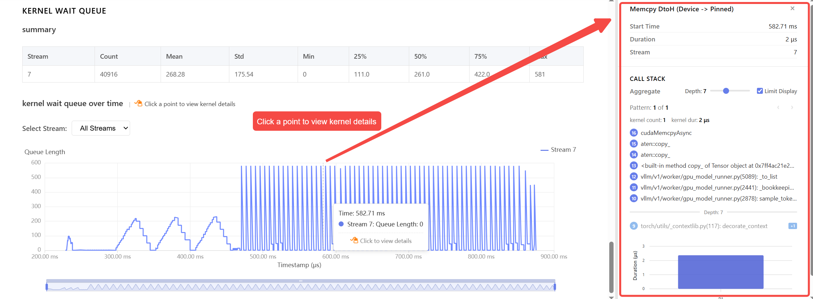

_下钻示意图：点击 `kernel wait queue over time` 中的某个点后，右侧侧栏会展示该时刻对应 kernel 的开始时间、持续时间、stream，以及聚合调用栈。_

## 5. Memory View 详解

`Memory View` 用来排查 memcpy 和数据搬运问题，重点回答“数据是否在 CPU、GPU、GPU peer 之间频繁移动，以及这些移动是否集中在某些时间段”。

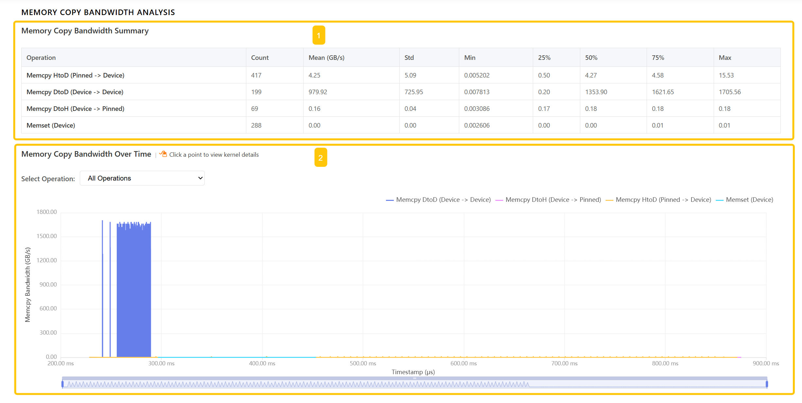

_`Memory Copy Bandwidth Analysis` 界面示意图：`1` 是 `Memory Copy Bandwidth Summary`，按操作类型汇总带宽统计；`2` 是 `Memory Copy Bandwidth Over Time`，展示带宽随时间变化的序列，可按不同 memcpy / memset 类型筛选并定位峰值区间。_

`Memory Copy Bandwidth Over Time` 展示不同时间点 memory copy event 的带宽占用，单位通常是 `GB/s`。

常见类型：


| 类型          | 含义           |
| ------------- | -------------- |
| `Memset`      | 内存设置       |
| `Memcpy HtoD` | CPU -> GPU     |
| `Memcpy DtoH` | GPU -> CPU     |
| `Memcpy DtoD` | GPU -> GPU     |
| `Memcpy PtoP` | GPU 点对点传输 |

判断方法：

- `HtoD` 相对偏高：可能是输入搬运、prefetch 不足或 host staging 问题
- `DtoH` 相对偏高：检查是否存在不必要的结果回传或同步读取
- `DtoD` / `PtoP` 相对偏高：结合分布式、张量并行或数据重排场景理解

点击 `Memory Copy Bandwidth Over Time` 中的某个 memory event 后，右侧会显示对应 kernel 详情和调用栈。


_下钻示意图：点击 `Memory Copy Bandwidth Over Time` 中的某个 memory event 后，右侧侧栏会展示该事件的开始时间、持续时间、带宽、数据量、stream，以及聚合调用栈。_

## 6. Distributed View 详解

`Distributed View` 只在多 rank 数据下出现，用于回答“不同 rank 是否均衡、通信是否被计算隐藏、是哪一段时间线出了问题”。

### 6.1 Kernel Time Breakdown


_`Kernel Time Breakdown` 示例：按 rank 展示 `Compute Time`、`Non-Compute Time` 和 `Idle Time` 的占比，用来快速判断不同 rank 的时间分解是否一致。_

这是多 rank 版本的 `Kernel Time Breakdown`。先看 rank 之间是否存在明显差异：

- 哪些 rank 的 `Compute` 相对更低
- 哪些 rank 的 `Idle` 相对更高
- rank 之间是否存在明显时间分解差异

如果某个 rank 的 `Idle` 或 `Non-Compute` 明显偏高，再继续看 `Cross-Rank Kernel Timeline` 和 `Communication Operator Timeline`。

### 6.2 Communication-Compute Overlap

这一块回答“通信有没有被计算有效覆盖”。

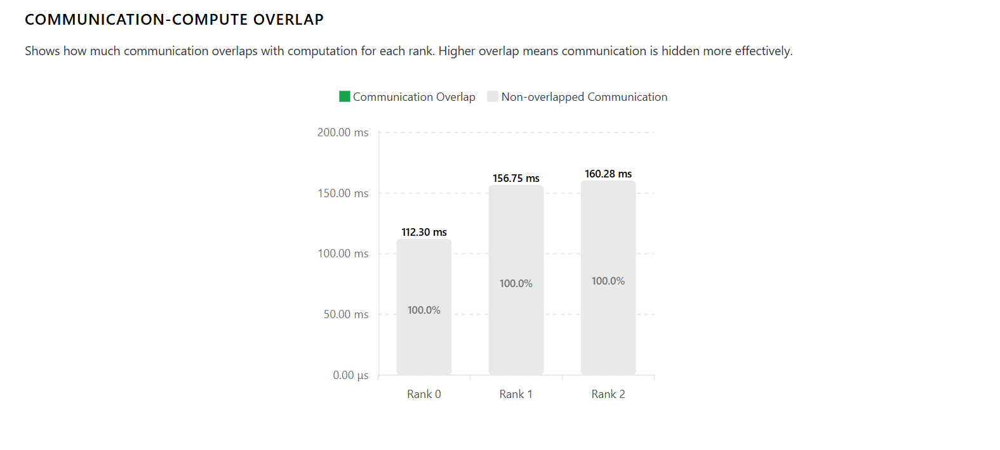

_`Communication-Compute Overlap` 示例：按 rank 展示通信时间中有多少被计算覆盖，越高表示通信越能被隐藏。_

核心指标：

```text
Overlap Ratio = overlap_time / communication_time
```

判断方法：

- 与同一阶段的其他 rank 对比。`Overlap Ratio` 相对更高，说明通信更可能被计算隐藏
- 与其他阶段对比。`Overlap Ratio` 相对更低，说明通信和计算更可能分段执行，容易暴露同步等待

### 6.3 Cross-Rank Kernel Timeline

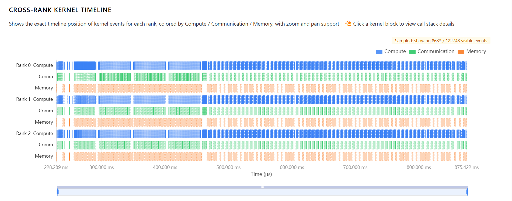

_`Cross-Rank Kernel Timeline` 示例：把各 rank 的 kernel 事件按 `Compute`、`Communication`、`Memory` 着色后铺在同一时间轴上，用来观察阶段推进、对齐情况和串并行关系。_

它会把各 rank 的 kernel 按 `Compute / Communication / Memory` 着色后铺在同一时间轴上。

重点看：

- 各 rank 是否在同一阶段同步推进
- 某个 rank 是否明显拖后
- 通信和计算是否交错、是否串行

`Cross-Rank Kernel Timeline` 当前不区分 stream，而是把同一 rank 的数据汇总到同一时间线内。

点击某个 kernel block 后，右侧会显示该 kernel 的名称、rank 和调用栈。

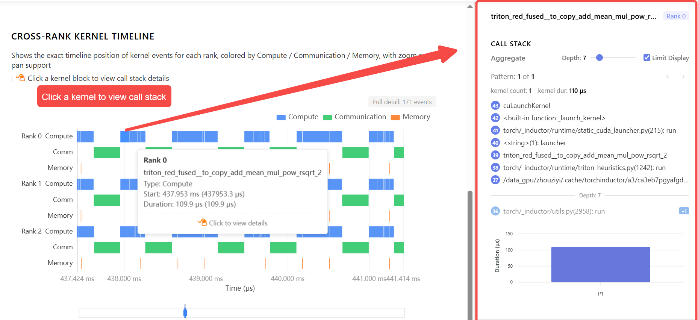

_下钻示意图：点击某个 kernel block 后，右侧侧栏会展示该 kernel 的名称、所属 rank，以及调用栈。_

### 6.4 Communication Operator Timeline

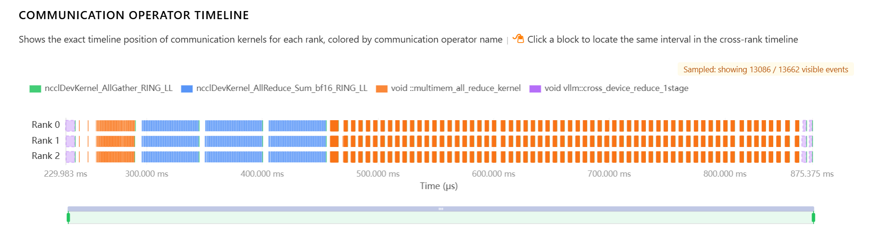

_`Communication Operator Timeline` 示例：按通信算子名称着色，展示各 rank 上通信 kernel 的精确时间位置，便于把注意力集中到 collective 和通信热点上。_

`Communication Operator Timeline` 专门用来聚焦通信算子：

- 展示每个 rank 上通信 kernel 的精确时间位置
- 按通信算子名称着色
- 点击某个 block，会在 `Cross-Rank Kernel Timeline` 中定位对应区间

当页面滚动经过 `Communication Operator Timeline` 后，它会自动吸附到顶部；点击 `📌` 可以锁定或取消锁定吸附状态。


_联动示意图：点击 `Communication Operator Timeline` 中的某个 block 后，页面会在 `Cross-Rank Kernel Timeline` 中定位同一时间区间，方便继续查看该通信前后的计算与内存事件。_

### 6.5 Cross-Rank Communication Operator Summary


_`Cross-Rank Communication Operator Summary` 示例：按通信算子名称聚合跨 rank 的耗时、调用次数、均值波动和启动时间偏差，是做最终归因时的主表。_

`Cross-Rank Communication Operator Summary` 按通信算子名称做跨 rank 汇总，适合做最终判断：

- 各 rank 的耗时统计
- 各 rank 间耗时偏差
- 各 rank 间同步偏差

判断方法：

- 某个通信算子的 `Duration Variance` 相对更高：说明该 collective 在不同 rank 上耗时不均
- `Launch-Time Skew` 相对更高：说明不同 rank 到达该通信点的时间不同步

如果某一行明显异常，优先回到 `Communication Operator Timeline` 和 `Cross-Rank Kernel Timeline` 定位具体区间。

展开某一行后，还可以看到更细的三类明细：

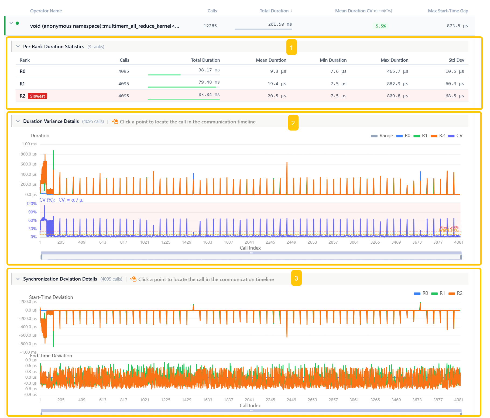

_详情示意图：展开某个通信算子后，可以继续查看 `Per-Rank Duration Statistics`、`Duration Variance Details` 和 `Synchronization Deviation Details`。_

这三部分分别回答不同问题：

- `Per-Rank Duration Statistics`
  - 每一行对应一个 rank，展示该通信算子的调用次数、总耗时、平均耗时、最小值、最大值和标准差
  - 主要用来回答“各 rank 的耗时差异有多大、波动有多大”
  - 如果某个 rank 被标成 `Slowest`，说明它在该算子上的耗时最高
- `Duration Variance Details`
  - 按调用序号展示每次通信调用在各 rank 上的耗时，对比每个通信在各 rank 的耗时偏差及其 `CV` 值；其中 `CV = σ / μ`，表示同一次调用在不同 rank 上耗时的相对离散程度
  - 主要用来回答“这个偏差是持续存在，还是只在少数几个调用上爆出来”
  - 如果只有少量尖峰，通常更像局部抖动；如果整段都偏高，更像系统性不均衡
- `Synchronization Deviation Details`
  - 展示各 rank 在同一次通信调用上的开始时间偏差和结束时间偏差
  - 主要用来回答“各 rank 到达该通信点是否同步、结束是否同步”
  - 如果开始时间偏差大，通常说明上游计算或调度不同步；如果结束时间偏差也大，说明通信执行本身也存在不均衡

这些明细图中的点还可以继续反查到时间线位置：

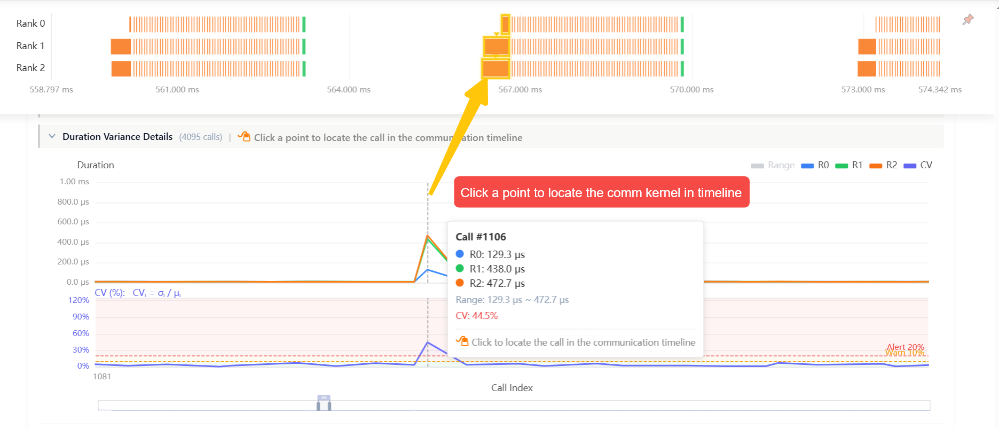

_定位示意图：点击 `Duration Variance Details` 或 `Synchronization Deviation Details` 中的某个点后，可以在 `Communication Operator Timeline` 中定位对应调用。_

## 7. Call Stack

`Call Stack` 是 Tracetto 中一个跨视图复用的侧栏组件，用来回答“这个 kernel / event 是从哪条 Python / 框架调用链上触发的”。在 `Overview`、`Operator View`、`Kernel View`、`Memory View`、`Distributed View` 中，只要点击具体的 kernel 条形、明细行或时间序列上的某个点，右侧侧栏都会展示同一个 `Call Stack` 面板。

出现 `Call Stack` 的典型入口包括：

- `Overview > Idle Time Statistics`：点击某一类 idle 的 kernel 明细，看是哪段调用链触发了这个 kernel
- `Operator View`：点击某个 operator 的 kernel 明细行，定位 operator → kernel 的具体调用链
- `Kernel View > Kernel Details / Launch Statistics / Kernel Wait Queue`：点击某个 kernel / launch详情 / kernel wait 队列某个时刻
- `Memory View`：点击时间序列中的某个 memory event
- `Distributed View > Cross-Rank Kernel Timeline`：点击某个 kernel block，查看其所属 rank 的调用栈

### 7.1 界面组成


_`Call Stack` 界面示意图：`1` 是聚合控制（`Aggregate`、`Depth`、`Limit Display`），`2` 是 `Pattern` 切换栏（显示当前是第几个 pattern、对应 kernel 数量与总耗时），`3` 是聚合调用栈列表（`3.1` 标记忽略本层差异、本层不参与聚合的 `IGNORED` 帧，`3.2` 标记本层在不同 pattern 中存在差异的 `DIFF` 帧，`3.3` 是层级 / Pattern 翻页），`4` 是当前 pattern 下各 kernel 实例的耗时分布柱图。_

> `4` 的耗时分布柱图同时也是 pattern 的快速切换器：直接点击某个柱形就会跳到对应的 pattern，柱图中当前选中的柱形会以高亮态与 `2` 中的 `Pattern x of N` 保持同步，便于在多 pattern 之间按耗时顺序快速翻看。


核心概念：

- **按层聚合**：相同前缀的调用栈会逐层合并展示，避免在同一 kernel 的多次调用之间反复看到完全一样的上层栈帧；面板顶部的 `Depth` / `Limit Display` 可以控制展示的最大深度
- **Pattern（调用链模式）**：同一个 kernel 在不同上下文里可能被不同的调用链触发，每一种独立的调用链就是一个 `pattern`。Tracetto 会按 pattern 对调用栈分组，方便对比同一 kernel 在不同入口下的差异

调用栈中每一行的右侧可能出现两类标记按钮，以及对应的查看操作：


| 标记      | 含义                               |
| --------- | ---------------------------------- |
| `IGNORED` | 忽略本层的差异，本层信息不参与聚合 |
| `DIFF`    | 本层在不同的 pattern 里存在差异    |


| 操作   | 作用                                      |
| ------ | ----------------------------------------- |
| `view` | 查看该 pattern 下，聚合时忽略掉的本层信息 |
| `all`  | 显示所有 pattern 下本层的信息             |

> `DIFF` / `IGNORED` 标记用于切换这一层是否参与聚合差异判断；`all` / `view` 按钮用于查看这一层的具体取值。`DIFF` 状态下可点 `all` 查看所有 pattern 的本层信息；切到 `IGNORED` 后可点 `view` 查看当前 pattern 中被忽略的本层信息。

### 7.2 `view`：查看该 pattern 下被忽略的本层信息

点击某一行右侧的 `view` 按钮，会弹出 **当前 pattern** 下、聚合时忽略掉的本层信息列表，用来确认这一层在该 pattern 下都包含哪些不同的取值。

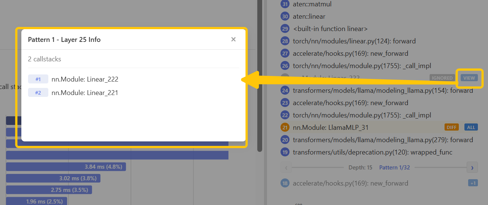

_`view` 弹窗示意图：在主面板上点击 `IGNORED` 行右侧的 `VIEW` 按钮后，会弹出 `Pattern N - Layer M Info` 面板，列出该 pattern 下本层被忽略的所有 call stack 项（如示例中的 `nn.Module: Linear_222` / `nn.Module: Linear_221`）。_

适合用来：

- 确认本层被忽略的差异是不是预期的同类调用（例如多个不同的 `nn.Linear` 实例）
- 看一个被忽略的层背后究竟覆盖了多少种调用

### 7.3 `all`：显示所有 pattern 下本层的信息

点击某一行右侧的 `all` 按钮，会弹出 **所有 pattern** 下本层的信息列表，用来对比同一调用栈层级在不同 pattern 中分别长什么样。


_`all` 弹窗示意图：点击 `DIFF` 行右侧的 `ALL` 按钮后，会弹出 `Layer M - All Patterns` 面板，按 pattern 罗列本层在每个 pattern 下的信息（如示例中各 pattern 对应的 `nn.Module: LlamaMLP_*`）。_

适合用来：

- 判断同一 kernel 是被多个上层模块共用，还是只在某一条调用链上反复出现
- 在多 expert / 多 layer 模型中，区分 kernel 是来自哪个 expert / 哪个 layer

### 7.4 推荐用法

1. 先从对应视图（`Operator` / `Kernel` / `Memory` / `Distributed` / `Overview > Idle`）点击进入某个 kernel，看默认聚合视图，找到主调用链
2. 看 `Pattern x of N`：如果 `N == 1`，说明该 kernel 只来自单一调用链；如果 `N > 1`，先用 `‹ ›` 翻一遍各 pattern 的耗时分布
3. 对关心的 `IGNORED` 层点 `view`，看该 pattern 下被忽略的本层信息，确认是不是预期的同类调用
4. 对带 `DIFF` 标记的层点 `all`，查看所有 pattern 下本层的信息，定位到具体是哪个 layer / expert / module
5. 调节顶部 `Depth` 和 `Limit Display`，在主调用链与完整栈之间切换查看

### 7.5 常见结论

- 单 pattern + 耗时集中：调用路径单一，优化重点在该调用链所在模块
- 多 pattern + 各 pattern 耗时接近：kernel 被多个模块共享调用，优化它本身的收益面更广
- 多 pattern + 某一 pattern 显著更贵：某个特定调用链有问题，结合 `DIFF` 层定位到具体模块
- `IGNORED` 层覆盖大量同类实例：通常是循环 / 多层堆叠结构（如多层 transformer block）忽略掉的本层差异，属于预期模式

### 7.6 场景示例：多 layer Transformer / 多 expert MoE

下面给两个常见模型结构下的案例演练，帮助把 `IGNORED` / `DIFF` / `pattern` 这几个抽象概念落到具体操作上。

#### 场景 A：多层 Transformer 中某个 GEMM kernel 反复出现

典型现象：在 `Operator View` 点击 `aten::mm` 后打开 `Call Stack`，右上角显示 `Pattern 1 of 1`（或者 `N` 较大、各 pattern 耗时近似），耗时分布柱图里所有柱形都在同一水平线附近。

解读流程：

1. 默认聚合视图里，可以看到某一行被标 `IGNORED`，内容形如 `nn.Module: TransformerBlock_*`
2. 这是按层聚合的预期模式：不同 transformer block 在该层的具体实例不同（`TransformerBlock_0` / `TransformerBlock_1` / ...），但它们都走相同的下游调用链，所以本层差异被忽略
3. 点击该行的 `view`，弹窗会列出该 pattern 下本层被忽略的全部实例，用来确认覆盖到了所有 layer
4. 结合 `2` 中的 `kernel count` 与 `kernel dur`，可以判断这个 GEMM 的总开销是被多少层叠加出来的

结论方向：这种情况下 kernel 本身是健康的，优化重点是减少层数 / 调小隐藏维度 / 用更高效的 GEMM 实现，而不是去找“某个特定调用链出问题”。

#### 场景 B：MoE 模型中某个 expert 异常更慢

典型现象：在 `Kernel View > Kernel Details` 点击某个 expert kernel 后打开 `Call Stack`，`Pattern x of N` 中 `N` 等于 expert 数量，`4` 区域的耗时分布柱图里有一根明显高于其他柱形。

解读流程：

1. 直接点击柱图中最高的那根柱形，主面板的 `Pattern x of N` 会同步切到对应 pattern
2. 在调用栈列表里找带 `DIFF` 标记的层，内容形如 `nn.Module: Expert_*` 或 `nn.Module: LlamaMLP_*`
3. 点击该行的 `all`，弹窗会按 pattern 罗列本层在每个 pattern 下的具体实例，可以看到“是哪个 `expert_id` 对应了那根高柱形”
4. 反过来再点击其他柱形，确认同 kernel 在其他 expert 上是否都偏短

结论方向：某个 expert 持续偏慢通常对应负载不均（routing 偏斜）、形状变化导致的 launch 抖动、或某个 expert 触发了不同的下游调用链。结合 `Operator View` 中该 expert 的 `Direct Kernels` / `Descendant Kernels` 一起看，可以进一步把问题落到具体的算子或子模块上。

> 不论是 A 还是 B 场景，`IGNORED` 行点 `view` 与 `DIFF` 行点 `all` 都可以在同一行上来回切换，配合 `4` 的耗时柱图，能够在「主调用链概览 → 单 pattern 细节 → 跨 pattern 对比」三种视角间快速切换。

## 8. Export Analysis Data

Tracetto 支持将当前 trace 的分析结果导出为离线文件，方便归档、对比、写报告或在其他工具中二次处理。导出入口位于页面右上角的下载图标（与 `Overview / Operator / Kernel / Memory / Distributed` 视图切换栏同一行）。

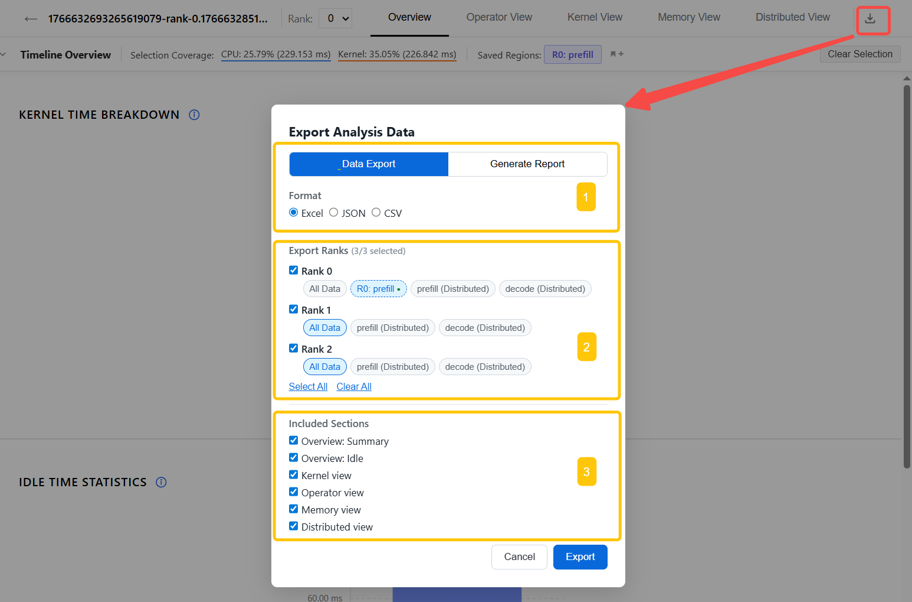

_`Export Analysis Data` 弹窗示意图：`1` 是导出类型与格式选择（`Data Export` / `Generate Report`，以及对应可选的 `Format`），`2` 是 rank 与时间范围选择（每个 rank 单独勾选，并通过 chip 选择 `All Data` 或某个已保存选区），`3` 是要包含的分析维度（`Overview: Summary` / `Overview: Idle` / `Kernel view` / `Operator view` / `Memory view` / `Distributed view`）。_

### 8.1 两种导出类型

弹窗顶部的 `Data Export` / `Generate Report` 用来选择导出风格：


| 类型              | 适用场景                                         | 可选格式                 |
| ----------------- | ------------------------------------------------ | ------------------------ |
| `Data Export`     | 把分析结果作为结构化数据导出，便于二次处理或入库 | `Excel` / `JSON` / `CSV` |
| `Generate Report` | 生成可直接阅读的分析报告，适合归档、汇报、分享   | `Markdown` / `HTML`      |

格式说明：

- `JSON`：C++ 引擎直接产出，结构最完整，所有维度都在一份文件里
- `CSV`：每个维度按表平铺，适合 Excel / Pandas 后续分析
- `Excel`：先取 `JSON`，前端转成多 sheet 的 `.xlsx`
- `Markdown`：C++ 引擎直接产出报告文本
- `HTML`：基于 Markdown + JSON 数据生成带图表的离线报告

### 8.2 选择导出的 Rank 与时间范围

`Export Ranks` 区域用来决定导出哪些 rank，以及每个 rank 对应的时间范围。

- **多 rank 文件**：每个 rank 一行，前面是勾选框；下方平铺出该 rank 可选的时间范围 chip
- **单 rank 文件**：直接显示一个 `Data Range` chip 区，无 rank 勾选

每行 chip 的来源：

- `All Data`：不加时间过滤，导出该 rank 的全量数据
- 单 rank 已保存选区：来自 `Timeline Overview` 中保存的 `Saved Regions`
- 带 `(Distributed)` 后缀的选区：来自 `Multi-Rank Timeline Overview` 中保存的多 rank 选区，会按对应 rank 的时间范围导出
- `Current Selection: ...`：当前未保存的临时选区。如果当前选区刚好等于某个已保存区域，则不会重复出现，而是在该已保存 chip 上显示 `●` 标记当前激活状态

底部 `Select All` / `Clear All` 用来快速勾选 / 取消所有 rank。

### 8.3 选择包含的分析维度

`Included Sections` 用来控制导出文件里包含哪几块分析结果，与页面的 tab 一一对应：

- `Overview: Summary` — `Overview` 中的 `Kernel Time Breakdown` 等汇总
- `Overview: Idle` — `Idle Time Statistics`
- `Kernel view` — kernel 类型分布、明细、launch、wait queue
- `Operator view` — 算子热点排序与 kernel 关联
- `Memory view` — 内存事件统计与时间序列
- `Distributed view` — 多 rank 通信 / 计算指标（仅多 rank 文件有效）

至少要勾一项才能点击 `Export`。

### 8.4 推荐用法

- 想做离线对比 / 入库：选 `Data Export` + `JSON`，保留全部维度
- 给 Excel 用户做明细分析：选 `Data Export` + `Excel` 或 `CSV`
- 写性能分析报告：选 `Generate Report` + `HTML`（带图表）或 `Markdown`（纯文本，便于嵌入文档）
- 多 rank 跨阶段对比：在 `Multi-Rank Timeline Overview` 中先保存好 `prefill` / `decode` 等区域，再到导出弹窗里给不同 rank 选不同的 `Distributed` 选区，一次导出多组数据

### 8.5 注意事项

- 导出过程中弹窗内会显示进度条，期间请不要关闭页面
- 大文件 + 全维度 + Excel 会比 `JSON` / `CSV` 慢，原因是前端要把 JSON 再转成 `.xlsx`
- 单 rank 文件下 `Distributed view` 维度通常没有数据，可不勾选
- 选区只对“可受时间过滤的维度”生效（如 kernel / operator / memory），全局 summary 仍按 rank 全量统计

## 9. 常见分析场景（Cookbook）

这一节给出几条高频分析路径。遇到典型问题时，不必从头浏览所有视图，按下面的步骤直接进入对应入口即可。每条路径都先缩小选区，再用视图之间的交叉证据做判断。

### 9.1 Prefill / Decode 对比

适合大模型推理或训练中的不同阶段对比。

推荐流程：

1. 在 `Timeline Overview` 中分别选中 `prefill` 和 `decode`
2. 保存为两个选区页签
3. 分别查看：
   - `Overview`：哪一段的 `Idle` / `Non-Compute` 更高
   - `Operator View`：哪一段的热点算子不同
   - `Kernel View`：哪一段的 launch 更碎、queue 更深
4. 到 `Call Stack`，比较热点 kernel 的调用路径是否来自不同模块

### 9.2 局部模块分析

适合定位 `embedding`、`ffn`、`vit`、某个 block、某个 expert 等局部路径。

推荐流程：

1. 在 `CPU Phases` 中逐层下钻到目标模块
2. 建立该模块的选区页签
3. 激活页签后再看 `Operator View` / `Kernel View` / `Memory View`
4. 如果同名 kernel 出现在多个模块中，用 `Call Stack` 的 `Pattern` 和 `DIFF` 信息区分具体来源

### 9.3 多 rank 通信异常

当你怀疑某个 collective 或某个 rank 拖慢整体时，推荐流程是：

1. `Distributed View > Kernel Time Breakdown`
2. `Distributed View > Communication-Compute Overlap`
3. `Distributed View > Cross-Rank Kernel Timeline`
4. `Distributed View > Communication Operator Timeline`
5. `Distributed View > Cross-Rank Communication Operator Summary`

### 9.4 GPU 利用率偏低

适合排查“GPU 经常空闲，但 trace 中没有明显单个热点算子”的情况。

推荐流程：

1. 在 `Timeline Overview` 选中低利用率阶段
2. 进入 `Overview`，确认 `Idle Time` 是否相对偏高
3. 如果 `Host Wait` 占比最高，进入 `Kernel View > Kernel Launch Statistics`
4. 如果 `Kernel Wait` 或 `Kernel Wait Queue` 异常明显，继续查看 `Kernel Wait Queue`
5. 点击异常点打开 `Call Stack`，定位是哪条调用链触发了碎 kernel 或等待

### 9.5 CPU launch 过碎

适合排查大量短 kernel、CPU launch 开销占比偏高的问题。

推荐流程：

1. 先在 `Overview` 确认 `Host Wait` 是否相对偏高
2. 进入 `Kernel View > Kernel Launch Statistics`
3. 查看 `Short GPU Kernels`、`Runtime Event Outliers`、`Launch Delay Outliers`
4. 点击异常分布进入明细，再点击具体行打开 CPU launch 事件与 GPU kernel 事件
5. 用 `Call Stack` 判断这些短 kernel 是否来自同一 operator、同一模块或循环结构

### 9.6 通信没有被计算隐藏

适合排查通信和计算串行、overlap 变差、某个 rank 等待其他 rank 的情况。

推荐流程：

1. 在 `Multi-Rank Timeline Overview` 对齐同一阶段
2. 进入 `Distributed View > Communication-Compute Overlap`，比较各 rank 的 `Overlap Ratio`
3. 在 `Cross-Rank Kernel Timeline` 中看通信与计算是否交错
4. 在 `Communication Operator Timeline` 中点击可疑通信 block，定位到前后 kernel 区间
5. 在 `Cross-Rank Communication Operator Summary` 中确认是耗时不均，还是到达通信点不同步

## 10. 常见问题（FAQ）

这一节汇总导入、解析和多 rank 使用时最常见的问题。排查时先看这里，再决定是否回到对应视图做细查。

### 10.1 选择文件后没有结果，或者解析失败

优先检查：

- 文件是否为 PyTorch Profiler 导出的 `.json` / `.json.gz`
- 是否是损坏文件或导出未完成
- 文件大小是否超过当前浏览器可处理上限
- 是否一次性导入了过多大文件

如果是超大文件：

- 优先使用支持 Memory64 的较新 Chrome
- 关闭其他浏览器页签

### 10.2 `.json.gz` 能直接使用吗

可以。Web 界面会自动识别并解压 `.json.gz`。

### 10.3 多 rank 文件的 rank 顺序怎么确定

在导入页中：

- 文件列表的顺序就是 rank 顺序
- 可以拖拽行重新排序
- 分析页面中的 rank 编号会按该顺序显示

如果文件名本身带有 `rank_0 / rank_1 / ...`，建议仍然手动确认一次顺序。
